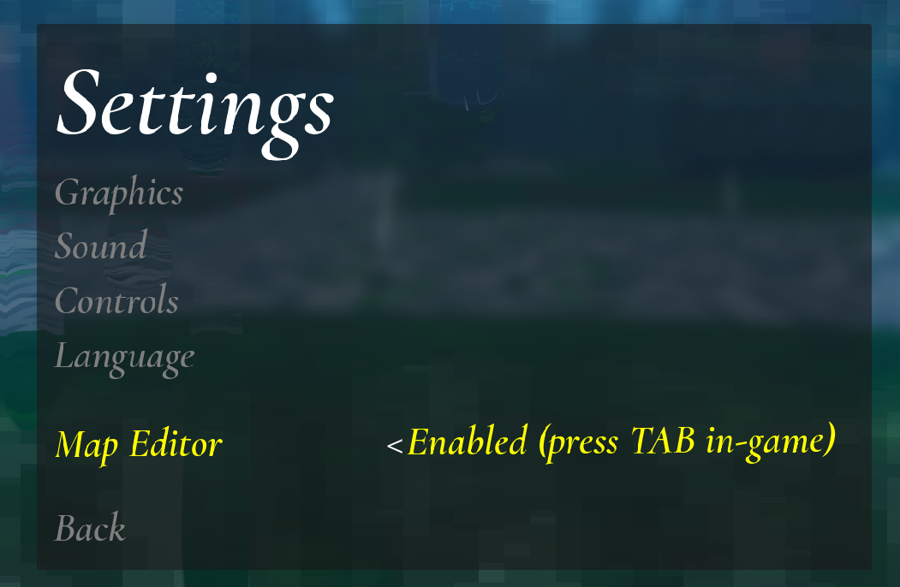
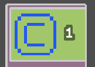
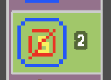
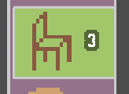
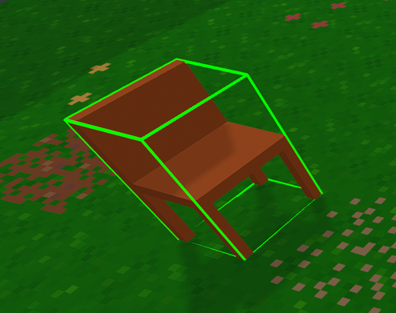
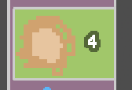
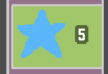
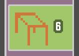
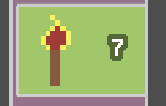
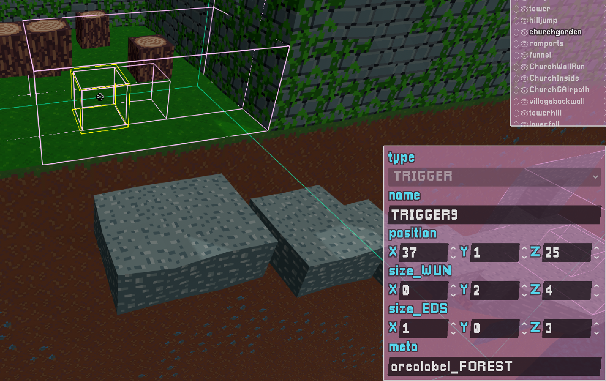

# [OEUF](https://store.steampowered.com/app/3831080/Oeuf/) MAP EGGITOR TUTORIAL

If you prefer a video version of the tutorial, here's one: https://youtu.be/BCKunr3oAbc

## Contents
* [0. How to add maps](#0-how-to-add-maps)
* [1. Enabling the Editor](#1-enabling-the-editor)
* [2. Basic Workflow in Editor](#2-basic-workflow-in-editor)
* [3. Camera and Movement (Editor Mode)](#3-camera-and-movement-editor-mode)
* [4. Voxel Tools](#4-voxel-tools)
* [5. Object Mode](#5-object-mode-entities-and-triggers)
* [6. Layer Mode](#6-layer-mode-large‑scale-editing)
* [7. Upload to steamworks](#7-upload-to-steamworks)
* [8. Feedback and bug reports](#8-feedback-and-bug-reports)

## 0. How to add maps

1. Go to **Custom Maps** on the title screen

2. Go to **Open Maps Folder** to open the map folder in your browser. You can add maps that you have gotten from other people here.

## 1. Enabling the Editor
1. Open **Settings**.

2. Enable **Map Editor**.
3. Load a level (custom levels are easiest to work with - the main game level has hard-coded stuff).
4. Press **Tab** to open the editor.

---

## 2. Basic Workflow in Editor

### Editor Modes:

- **Tab**:
  - Enters/exits editor mode.
  - In editor mode, toggles mouse control between camera/cursor mode.
- **Space**: Respawn where you're pointing at.
- **Backtick** (**`**) to cycle:
  - **Voxel Mode** (editing terrain)
  - **Object Mode** (checkpoints, triggers, props)
  - **Layer Mode** (moving large sections of terrain)

### General commands:

- **CTRL + S** save.
- **F5** reload from save.
- **CTRL + Z** undo.

In the top left of the screen you can see :

* the current file name (change and press enter to save as a new file)
  * (note Some built‑in maps are read‑only (e.g., `minimal`, `egg world`). You can save them under other files names ok though!)
* the dropdown button to list/open existing files
* the button to open up the levels folder (shortcut: **Ctrl + L** in your operating system's file browser, should you wish to share levels with others. :)

---

## 3. Camera and Movement (Editor Mode)
- **WASD**: Move.
- **Shift**: Faster movement.
- **Q / E**: Down / Up.
- **Z / C**: Rotate Left / Right.
- (don't forget, **TAB** toggles camera/cursor mode)

---

## 4. Voxel Tools:

### 4.1 Basic Voxel Placer
- **Left click**: Place block.
- **Right click**: Delete block.
- **Shift + left click (hold)**: Rapid placement.
- **Shift + right click (hold)**: Rapid deletion.
- **Ctrl + left click**: Place a block one tile removed from the face you're targetting.
- **Alt + click**: Sample an existing block (eyedropper).
- **Mouse wheel** or **"Shift+number keys"**: Change current tile.
- **Ctrl + mouse wheel** or **- / +**: Change tile page.

### 4.2 Plane Drag / Wall Tool

- **Left click + drag** to draw a planar sheet (floor or wall).

- **Shift while dragging**: Push the plane one voxel into the target surface for a flush surface:

- **Right click + drag**: Delete a planar region (good for making doors/openings)

- Holding **Alt** while doing the above causes the initial point you click to be the centre of the plane rather than the corner.

### 4.2b aside - Voxel Shapes and Rotation

- The top-right palette includes ramps and other shaped voxels.
- **R**: Rotate selected shape.
- **V**: Flip vertically.
- Helpful for slopes, roofs, and non‑cubic geometry.
- If you're drawing a plane and have the 45 degree slope selected, you drag a 45* slope rather than an axis-aligned plane.

---

### 4.3 Extrude Tool
- **Select an area**, then **drag** to extrude it outward.
- Works on irregular shapes.

- **Right‑click variant** deletes large cuboids for cleanup. Basically nothing to do with extrude, more a "delete everything in this volume" tool.

### 4.4 Room / Box Tool

- **Click + drag** to create a hollow rectangular volume.
- **Shift while using**: Removes end caps (for tunnels / open boxes).

### 4.5 Paint Tool

Paints existing voxels.

- **Alt + click**: Sample tile (including shape).
- **Click**: Paint.
- **Shift + mouse wheel**: Adjust brush radius.
- **Shift + click**: Replace all tiles in the current layer with the selected tile (undoable, but be careful).

---

### 4.6 Landscape / Hill Dropper Tool
- Drops blocks from above to form organic hills.
- **Mouse wheel**: Hill height.
- **Shift + mouse wheel**: Hill width.
- Useful for mountains and natural terrain; can layer materials.

---

### 4.7 Grow / Shrink Tool

Spherical modifier with an intensity meter (controlled with **Mouse wheel**):

  - Low setting: shrink/erase inside the sphere.
  - High setting: grow/extrude outward.
  - Mid setting: tends to square off shapes.
- **Shift + mouse wheel**: Adjust brush radius.

---

### 4.8 Add / Subtract Sphere Tool

Adds/removes a sphere!

- **Mouse wheel**: Choose tile.
- **Shift + mouse wheel**: Change sphere size.
- **Left click**: Add a sphere.
- **Shift + left click**: Center sphere on cursor point.
- **Right click**: Subtract a sphere (good for caves).

---

### 4.9 Smooth / Grout Tool

- **Click**: Smooth terrain by inserting appropriate edge pieces (using one of the neighbouring textures).
- **Shift + mouse wheel**: Change brush size.
- **Shift + click**: Grout mode; fills seams using the current tile instead of smoothing.

---

### 4.0 Planar Draw Tool
- **Click** and drag to draw on the current plane.
- **Shift + mouse wheel** raises and lowers the drawing plane.

---

## 5. Object Mode: Entities and Triggers
Enter Object Mode by pressing **backtick** until the Object UI appears.

### 5.1 Entity Tool 

This mode has two brushes, one for placing entities, another for placing trigger volumes.  

- **Left Click** to place/select
- **Right Click** to delete
   
###  5.1.1 Bonfires (Start/End/Checkpoints) 

- Every level must include:
  - A start bonfire named exactly `START` (Case important)
  - An end bonfire named exactly `END`
- Names are case‑sensitive.
- Removing them breaks spawning; undo restores them.
- Intermediate bonfires can have custom messages.

### 5.1.2 Forbidden Checkpoint 

DO NOT USE IT'S AN AD HOC THING TOO FIDDLY TO EXPLAIN AND OF NO GENERAL USE.

### 5.1.3 Chair 

Just a bit of geometry.  Not used in the main game.

### 5.1.4 Nest 

DO NOT USE THE NEST.  It is not a cosmetic object, it is used to signal that the game is in the main mode - it triggers intro/end cutscenes and other things.  Fine if you're modifying the main game, but not for new levels!

### 5.1.5 Star 

- Makes a nice sound when you collect them and shows you how many you've collected vs total in the level.
- Totally optional and of no consequence.
- (I implemented these thinking I might want to put them in the main game, but decided better of it in the end).

### 5.1.6 Table  

Just a bit of geometry.  Not used in the main game.

### 5.1.7 Torches 

- What it looks like.  Nice if things are getting a bit dark innit.
- But don't overdo it, each torch has a light and the cost might add up.

### 5.2 Trigger Boxes
- Triggers are rectangular volumes.
- Properties include:
  - **Position**
  - **Extents/size**
  - the 'meta' field contains some action to trigger when the player goes into the box.
 
### 5.2.1 "music_"
- Triggers can run commands; example shown is a **music_trigger** that plays a named track on entry.
  - Look around the main game to see what music is triggered where.
  - You find a list of all the music files used in the OST [here](https://store.steampowered.com/app/4217410/Oeuvre_Oeuf_Soundtrack/). The game has about an hour of music, but there are many hours more of tracks included in the game for to choose from for your custom levels.

### 5.2.2 "arealabel_

So this is a trigger that will cause an area name to appear independetly of a checkpoint being set.  If you the bit afte arealabel_ is a built-in location name (Case-sensitive), then it will display the name of the location as in-game. Otherwise, it will display the text you put in verbatim.  For example, if you put it to be "arealabel_Hello, world!" it will display "Hello, World!"

### 5.2.2 "KILLBOX"

- Special trigger volumes (drawn red in the editor for easy identification) that cause the player to die on contact (next time you touch some level geometry).
- Useful for hazards and boundaries.

---

## 6. Layer Mode: Large‑Scale Editing

Cycle to Layer Mode with **Backtick** (**`**).

- It can be useful to divide large maps into sections/layers

### 6.1 Layer Visibility
- Click a layer to hide/show it.
- **Shift + click** a layer to hide all other layers; shift‑click again to restore thhem.

---

### 6.2.1 Layer Selection/Transformation tool 

- Use the layer selection tool to pick a layer by clicking geometry.
- You can then **move**, **rotate**, or **mirror/flip** the entire layer.
- One one voxel can occupy a single position - if you drag one layer to overlap another, voxels are going to get deleted from one of the layers!
- Do not use the staircase block - it does not play well with egg physics.

---

### 6.2.2 Voxel Assignment Tool 

- Drag a volume; all voxels inside become part of the currently selected layer.
- Useful for fixing pieces assigned to the wrong layer.

---

### 6.3 Copy/Paste Layers

- Copy a selected layer/group and paste it as a brush.
- Select the Copy tool (3) and click anywhere to copy the current layer to the clipboard.
- Select paste and move (not rotate) your camera - note that you can now see the outline of the layer move with your camera - click to paste a copy of the copied layer.
- You can copy/paste between different files!

---

## 7. Upload to steamworks

Uploading to steamworks is a pretty easy affair - when you're happy with your level, just hit the steam button in the toolbar:

Click on this, and wait for a moment, and you will see a message when the upload is complete, and it should open the steamworks page as well.

The thumbnail is generated from the view when you hit save.  

If you wish to customize the details further you can do it from that page.  The mod is associated with the file name of the map - if you resave the file it will update your level on the steamworks server.

---

## 8. Feedback and bug reports

Does this make sense? I hope so - feedback and bug reports always welcome: e-mail me at analytic@gmail.com
