# [OEUF](https://store.steampowered.com/app/3831080/Oeuf/) MAP-EGGITOR TUTORIAL

> **If you prefer a video-tutorial, click here: [https://youtu.be/brkR8vVeSMg](https://youtu.be/brkR8vVeSMg)**

## 0. Adding Player-Made Maps

There are two ways to add maps by other people - if you already have the file, you can add it manually, or if you want to download it from steam workshop, you can do that too.

### 0.1 Adding Maps Manually

If you have a map file, you can add it like this (doesn't work on Steam Deck!) :

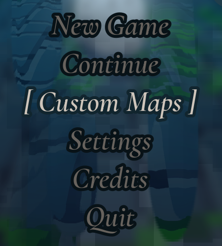

1. Go to **Custom Maps** on the title screen

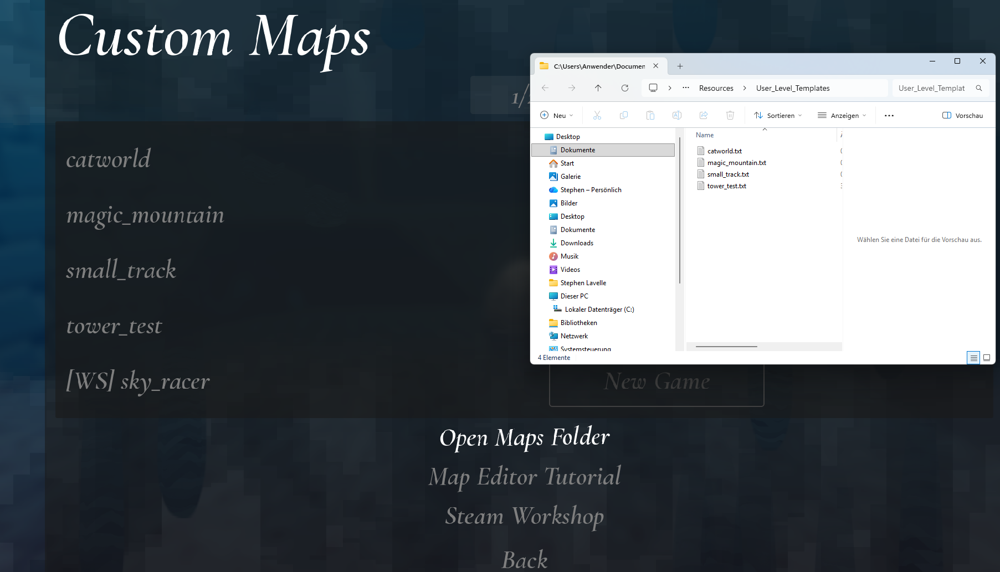

2. Go to **Open Maps Folder** to open the maps folder in your file manager. You can add map files that you have gotten from other people here.

### 0.2 Adding Maps from Steam Workshop

1. Go to **Custom Maps** on the title screen

2. Click on **Steam Workshop**

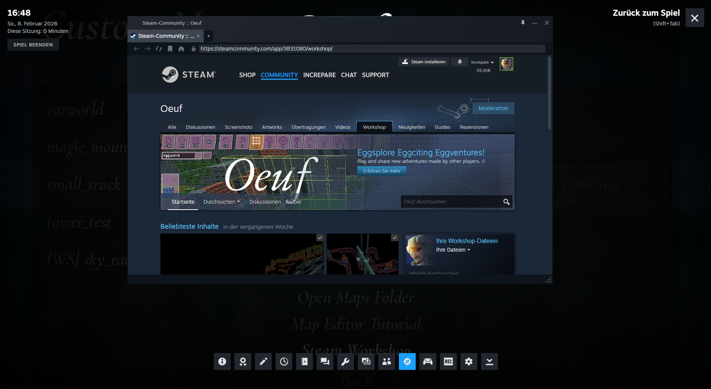

3. On Steam Workshop, you 'subscribe' to things to download them.  

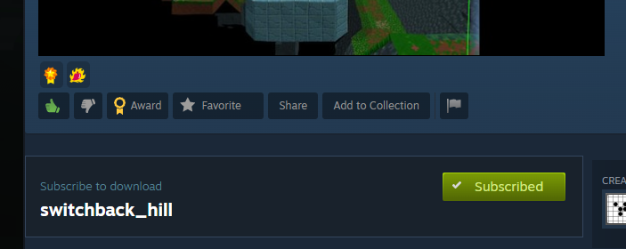

4. Once you've done that, they should just be visible in the map list to play.

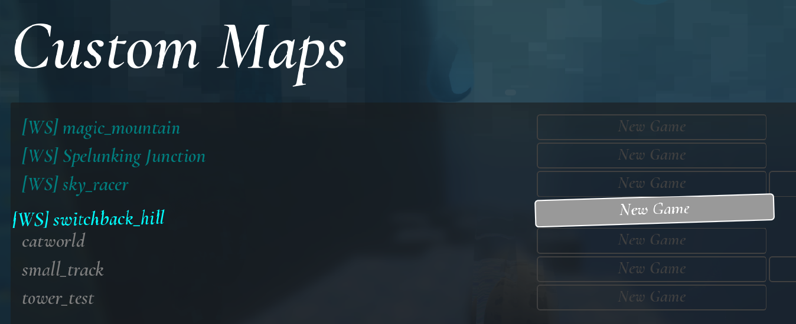

## 1. Enabling the Map-Editor
1. Open **Settings** :

2. Enable **Map-Editor**.
3. Load into a level (custom levels are easiest to work with - the main game level has hard-coded stuff).
4. Press **Tab** to open the map-editor.

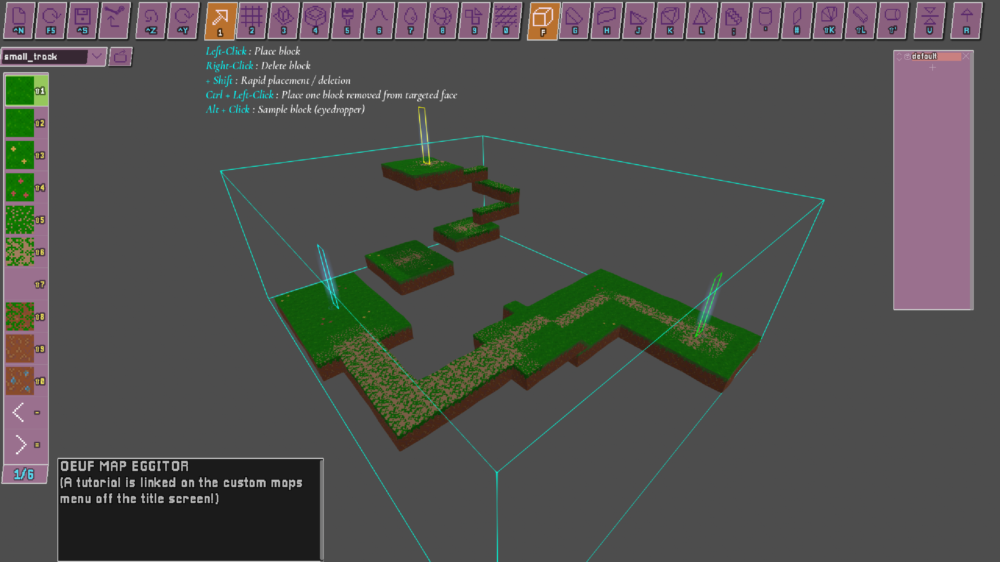

---

## 2. Basic Workflow in the Map-Editor

### 2.1 Map-Editor Modes

- **Tab**
  - If you're in-game, it opens the map-editor!
  - In the map-editor, it toggles mouse control between camera-look and cursor-pointing.
- **Space** : Exits edit mode and spawns you where you're pointing at.
- **Backtick** (**`** or whatever key is to the left of the '1' on your keyboard) to cycle between :
  - **Block Mode** : Editing terrain
  - **Entity Mode** : Checkpoints, props, trigger-boxes
  - **Layer Mode** : Moving large sections of terrain

### 2.2 General Shortcuts

- **Ctrl + S** : Save
- **F5** : Reload
- **Ctrl + Z** : Undo
- **Ctrl + Y** : Redo
- **Ctrl + R** : Randomly rotates all *cube-shaped blocks* with the currently-selected texture in the currently-selected layer.

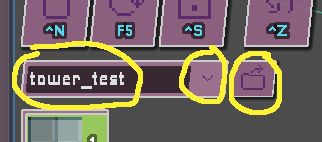

To the top left of the screen you can see :

- the current map name (change and press enter to save as a new file)
- the dropdown menu - it lists all **built-in maps** (e.g., `minimal`, `eggworld`), alongside those you have saved in your level folder (N.B. built‑in maps are read‑only. You can save them under other files names though!)
- the button to open up the levels folder (shortcut : **Ctrl + L**).

---

## 3. Camera and Movement (Editor Mode)
- **WASD** : Move camera
- **Shift** : Faster movement
- **Q / E** : Up / Down
- **Z / C** : Rotate Left / Right
- (don't forget : **TAB** toggles camera-look and cursor-pointing modes.)

---

## 4. Block Tools :

<!--nearest neighbour upscaling-->
### 4.1  Basic Block Placer 
- **Left-Click** : Place block.
- **Right-Click** : Delete block.
- **Shift + Left-Click (hold)** : Rapid placement.
- **Shift + Right-Click (hold)** : Rapid deletion.
- **Ctrl + Left-Click** : Place a block one block removed from the face you're targeting.
- **Alt + Click** : Sample an existing block (eyedropper).
- **Scroll-Wheel** or **Shift+number keys** : Change currently-selected block-texture in the left toolbar.
- **Ctrl + Scroll-Wheel** or **- / +** : Change texture page in the left toolbar.

#### 4.1b (Aside : Block Shapes) 

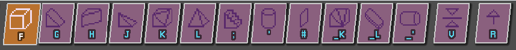

- The top-right toolbar includes ramps and other shapes.
- **R** : Rotate selected shape.
- **V** : Flip vertically.
- The shortcuts are as listed above - note that an underscore **_** means to hold **Shift** while pressing the named key.
- If you're drawing a plane and have the 45° slope selected, you drag the plane along the slope :

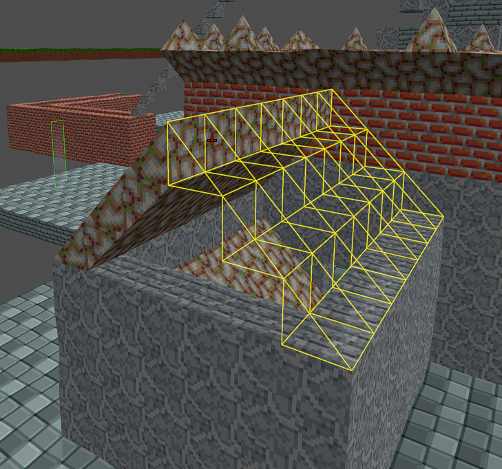

- Do *not* use the staircase block anywhere where the player might roll across it - it does not play well with egg physics.

### 4.2 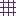 Plane Tool

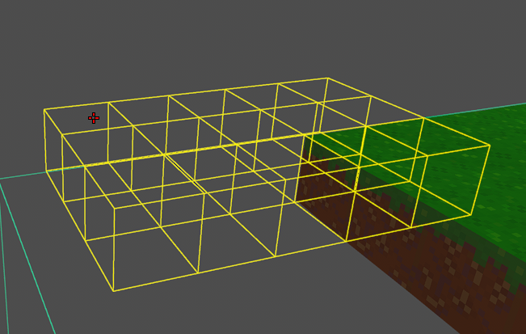

- **Left-Click + Drag** to draw a planar sheet (floor or wall).

- **Shift while dragging** : Push the plane one voxel into the target surface for a flush surface :

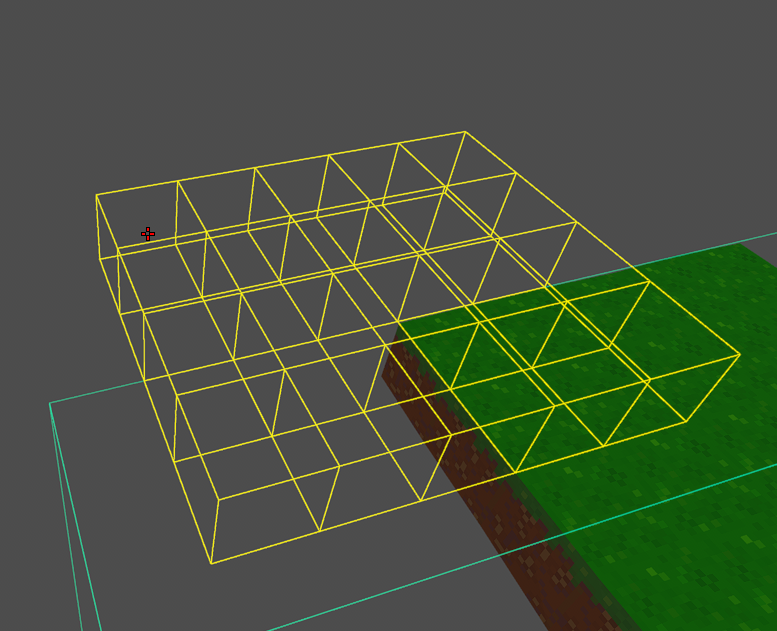

- **Right-Click + Drag** : Delete a planar region (good for making doors/openings)

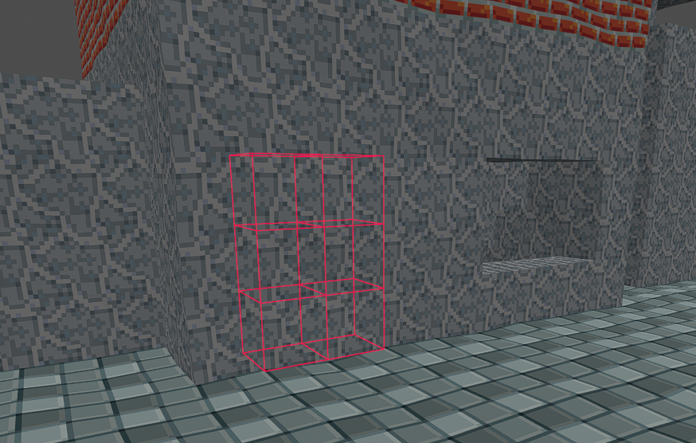

- Holding **Alt** while doing the above causes the initial point you click to be the *centre* of the plane rather than the corner.

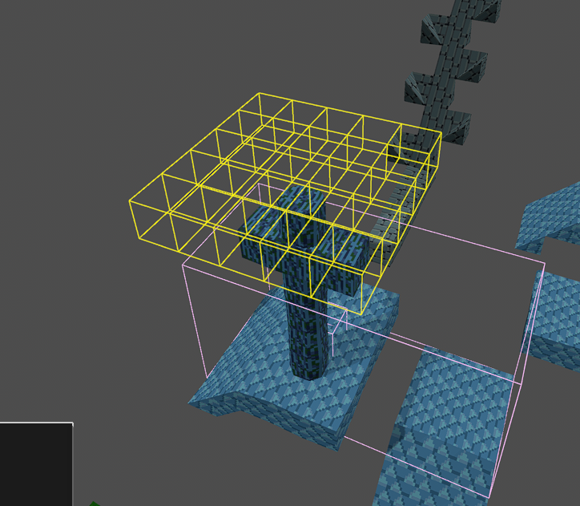

---

### 4.3  Extrude Tool 
- **Drag out a 2D-area**, then move your mouse and **Click** to extrude your selection to that point.  Very useful!
- Works on irregular shapes :

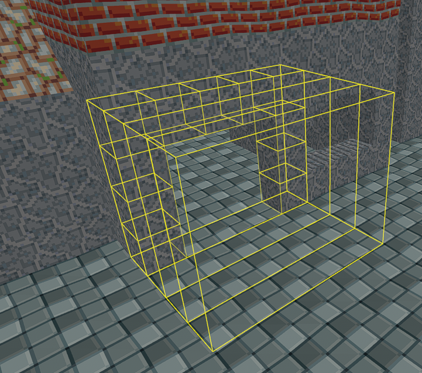

- **Right‑Mouse-Button** Nothing to do with extrude, really, more a "delete everything inside this box" tool.

### 4.4  Box Tool 

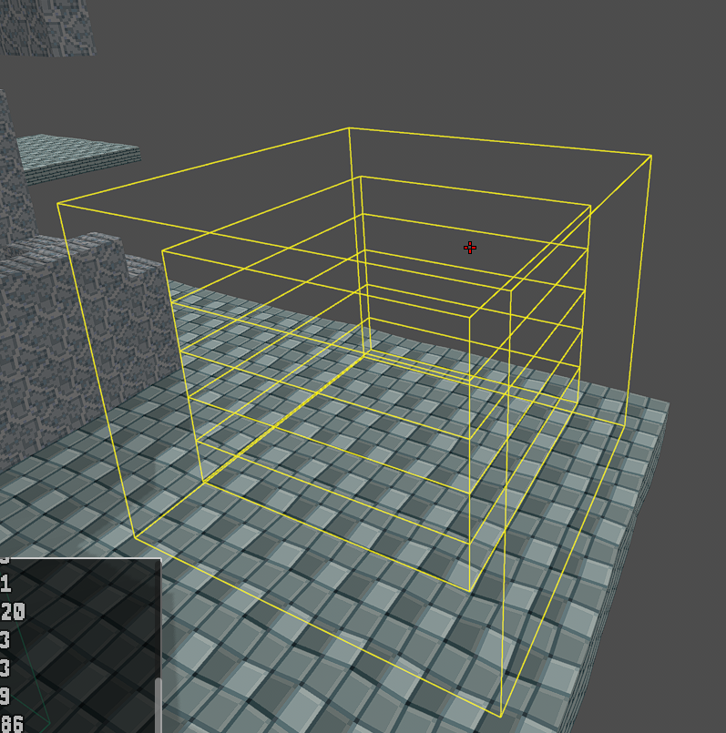

- **Left-Click + Drag** to create a hollow box.
- **Shift** while dragging : Removes end caps (for tunnels / open boxes).
- **Right-Click** : Carve out a room.

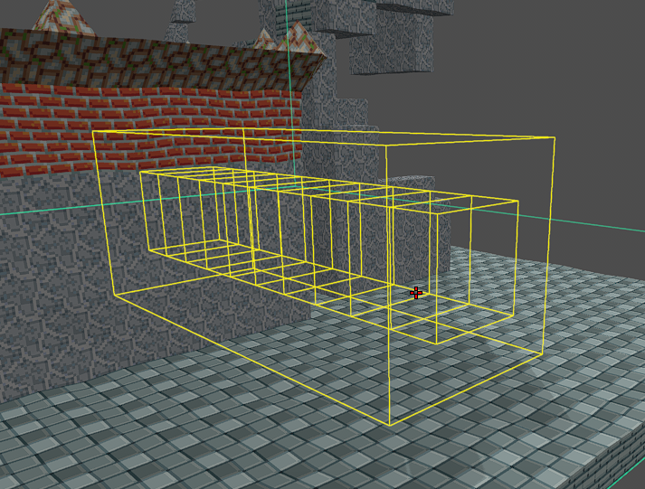

### 4.5  Paint Tool 

- **Left-Click** : Apply texture to block
- **Right-Click** or **Alt + Left-Click** : Sample block texture and shape.
- **Shift + Scroll-Wheel** : Adjust brush radius.
- **Shift + Left-Click** : Replace all blocks of the pointed-at texture in the current layer with the selected texture (undoable, but be careful).

---

### 4.6  Hill-Dropper Tool 
- **Left-Click** : Drop blocks from above to form organic hills.
- **Right-Click** : Subtract hill-shape from terrain.
- **Scroll-Wheel** : Hill height.
- **Shift + Scroll-Wheel** : Hill width.
- Useful for mountains and natural terrain; can be used to create 'geological'-looking layers.

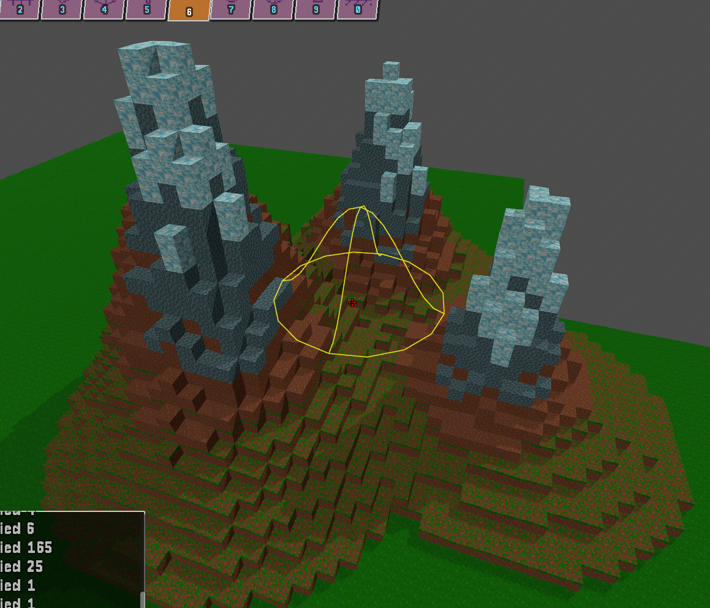

---

### 4.7  Sculpt Tool 

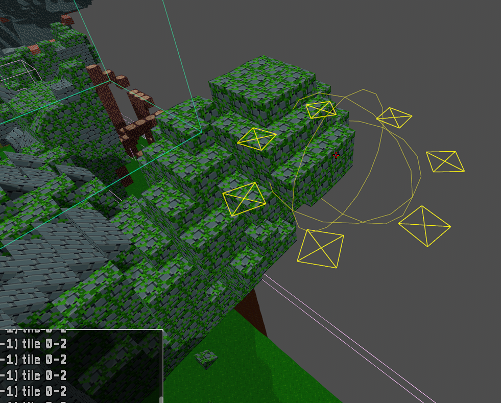

Grow/shrink your terrain within a sphere.

- **Scroll-Wheel** : control intensity
  - ****Low** : shrink/erase terrain inside the sphere.
  - **High** : grow/extrude terrain inside the sphere.
  - **Mid** : tends to square off shapes.
- **Shift + Scroll-Wheel** : Adjust brush radius.

---

### 4.8  Sphere Tool 

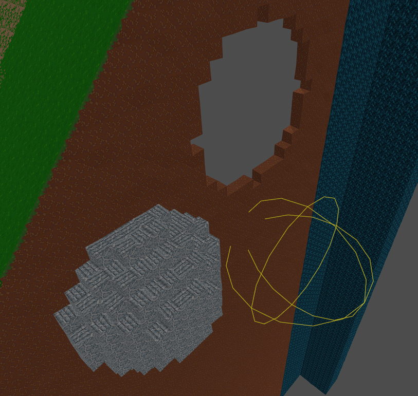

Adds/removes a sphere!

- **Scroll-Wheel** : Choose texture.
- **Shift + Scroll-Wheel** : Change sphere size.
- **Left-Click** : Add a sphere.
- **Shift + Left-Click** : Centre sphere on cursor point.
- **Right-Click** : Subtract a sphere (good for caves).

---

### 4.9  Grout Tool

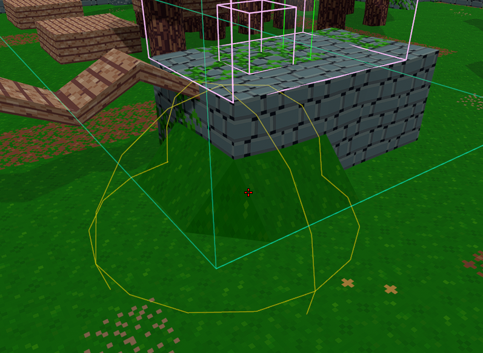

- **Left-Click** : Smooth terrain by adding appropriate edge pieces using one of the neighbouring textures.
- **Ctrl + Click** : Smooths using the currently selected toolbar texture.
- **Right-Click** : Removes non-cube blocks.
- **Shift + Scroll-Wheel** : Change brush size.

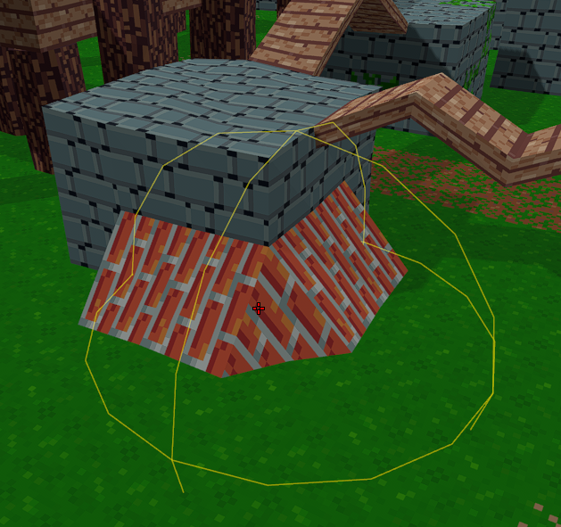

---

### 4.10 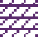 Planar Drawing Tool 
- **Left-Click** and drag : draw on the current horizontal plane.
- **Right-Click** : Remove blocks
- **Shift + Scroll-Wheel** : Raise / Lower the drawing plane.

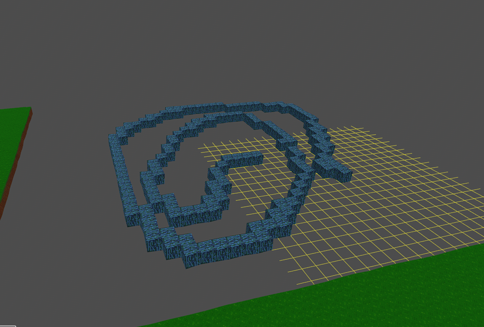

---

## 5. Entity Mode
Enter Entity Mode by pressing **Backtick** **`** until the Entity UI appears.

In Entity Mode there are two tools - *object* placement and *trigger-box* placement.  Objects are things that are placed in the world that you can see and are placed at a single coordinate, like checkpoints and torches.  Trigger-boxes are larger areas, invisible to the player, which trigger an effect when the player enters them, like playing a music track, or displaying a message. 

### 5.1  Object Tool 

This mode has two brushes, one for placing objects, another for placing trigger-boxes.  

- **Left-Click** to place/select
- **Right-Click** to delete
   
#### 5.1.1  Start-Checkpoint 

- Every level *must* include a **Start-Checkpoint**.
- This is where the player spawns in custom levels, but looks just like a normal checkpoint.
- The area_name tag is what text gets shown when you spawn into the level. By default the value is "CUSTOM_LEVEL_LETS_GO", which is a specific localized key that is "Let's go!" in English.
- (The 'Nest.tcsn' asset can also function as a 'start checkpoint', but its behaviour has a lot of hard-coded nonsense in it so I don't recommend using it in your own levels, unless they mod the regular game - and even then, be careful to test it and not modify the geometry around the starting area too much)

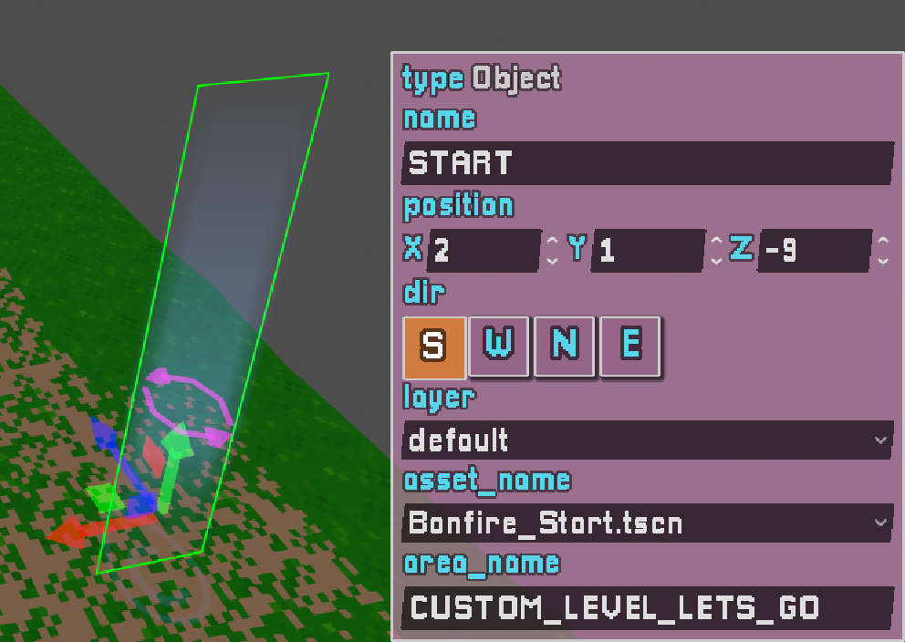

#### 5.1.2  Normal Checkpoint 
- Totally normal checkpoint.
- You can set the area_name tag to whatever you want to display when the player activates it.
- If you want to trigger music when you reach the point, or spawn back to it, you have to use a music trigger-box for that.

#### 5.1.3  End-Checkpoint 
- Unlike the main game, custom levels don't really have a proper final checkpoint (unless they use the nest).  This is just a normal checkpoint really.
- By default the area_name tag is "CUSTOM_LEVEL_YOU_MADE_IT", which is localized to "You made it!" in English. But you can put whatever you want in there.

#### 5.1.4 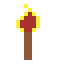 Torch 

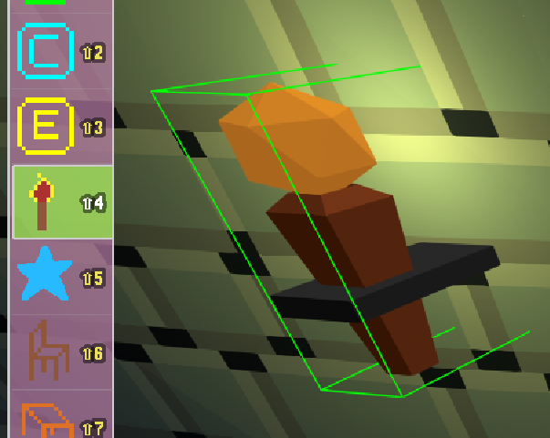

- What it looks like.  Nice if things are getting a bit dark innit.
- But don't overdo it, each torch has a light and the cost might add up.

#### 5.1.5  Star 

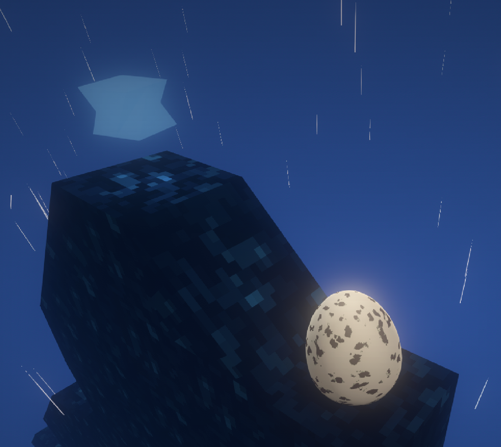

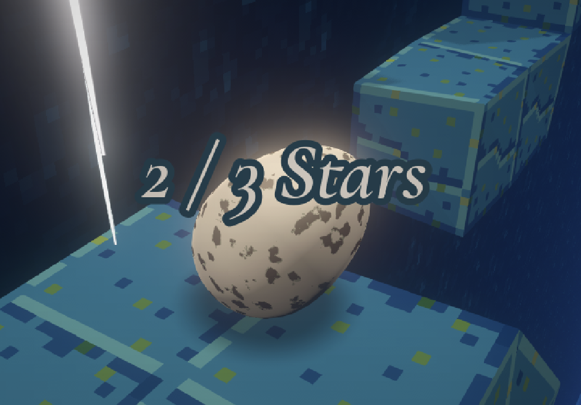

- Makes a nice sound when you collect them and shows you how many you've collected vs total in the level.
- Totally optional and of no consequence (I implemented these thinking I might want to put them in the main game, but decided better of it in the end).

#### 5.1.6 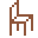 Chair 

Just a bit of geometry.  Not used in the main game.

#### 5.1.7 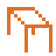 Table 

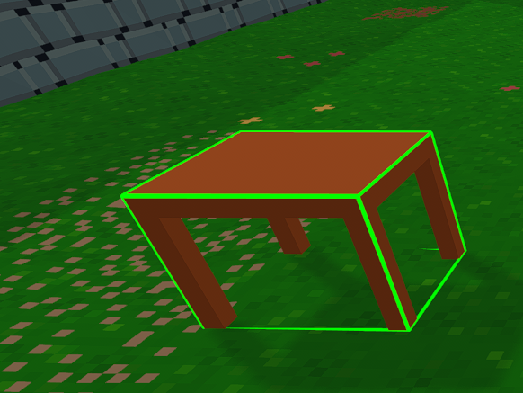

Just a bit of geometry.  Not used in the main game.

#### 5.1.8 Other objects

There are other objects in the game, accessible via the asset_name dropdown in the entity info panel, but they contain weird/hacky behaviour specific to the main game, so I don't recommend using them.  Stuff like the Nest.tscn object that just has a lot of hard-coded and very particular behaviour that I don't want to explain.  However, modifying the main game map should be safe enough, even though it contains these objects - just be careful of modifying these objects or their surroundings in-game if you come across them!

### 5.2  Trigger-Box Tool 

- Trigger-boxes are big invisible areas that do something when the player enters them.

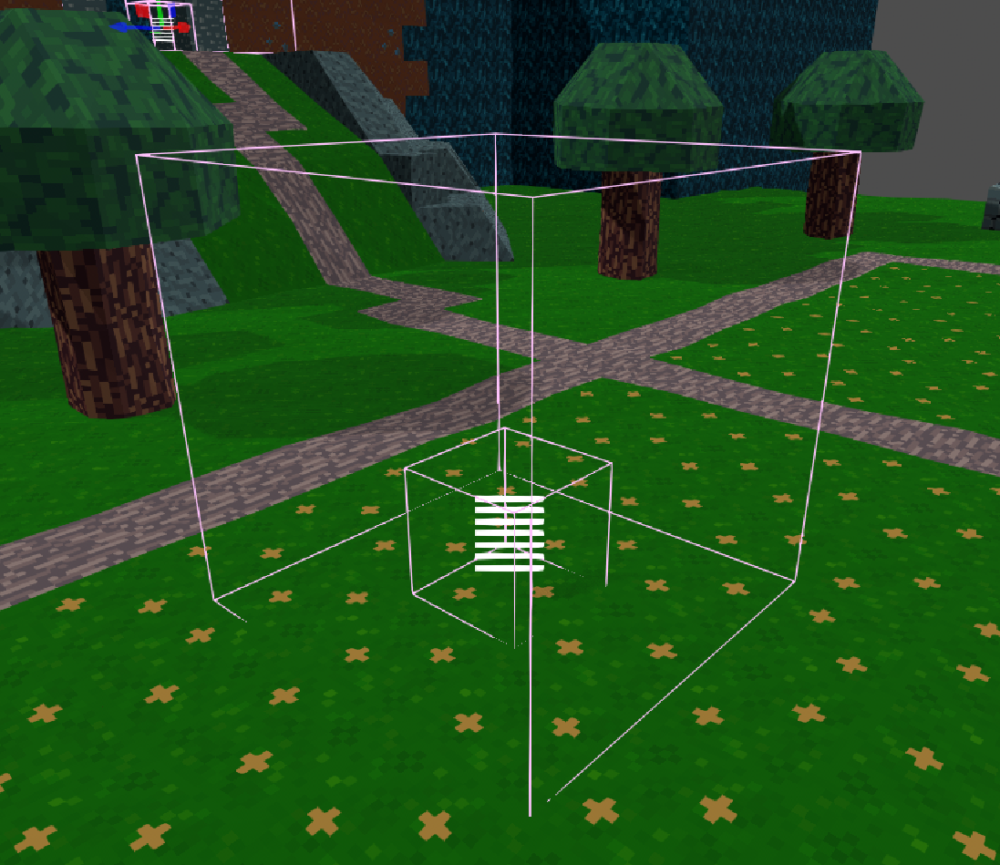

- In the sidebar you can edit various properties, including their position and dimensions (WUN=West/Up/North, EDS=East/Down/South):

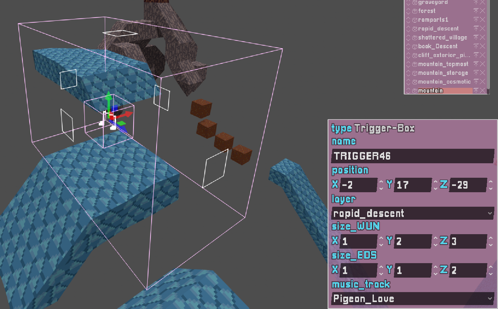

- You can also **move** and **resize** trigger-boxes in the viewport using the **move gizmo** and **face resize handles** (drag the coloured handles on each face of the box).

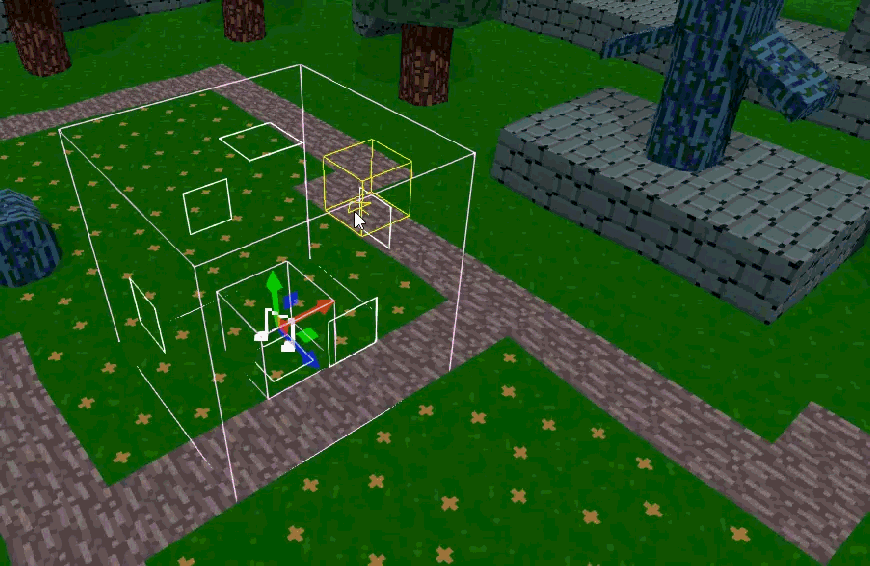

- Note that trigger-boxes have a 'core' 1x1x1 cube that you have to click to edit them (technically it doesn't even have to be inside the trigger-area, but...why would you do that?)

#### 5.2.1  music 
- This causes music to play if you enter it.  
- Usually you want to have a music trigger at each checkpoint, so that if a player resumes a save game, there'll automatically be the right music playing.
- You can choose the music track from a dropdown list in the properties panel.

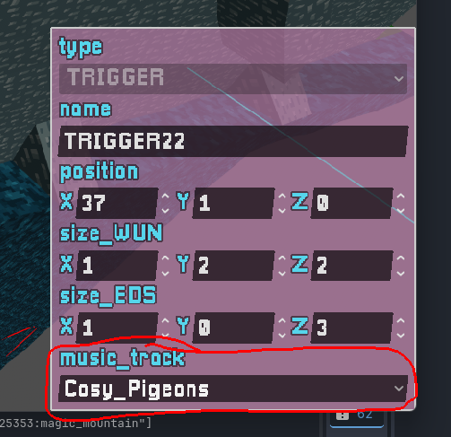

- Any time in the map-editor you click on a music trigger you'll hear a preview of its music.
- You can't include your own music files. However in addition to the core OST of the game, there are several hours of bonus tracks included for people who want to make their own levels to use.
- The Music OST is [here](https://store.steampowered.com/app/4217410/Oeuvre_Oeuf_Soundtrack/) if you want to listen to it casually.

#### 5.2.2  arealabel 
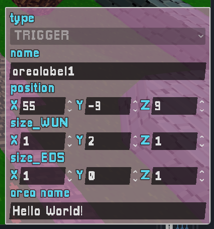

Arealabel trigger-boxes show a message on screen when the player enters, independently of checkpoints. If the 'area name' is a built-in location name (case-sensitive), the game displays that location name (and will localise it. e.g. if you enter "FOREST" the text will be "Forest of Branching Paths"); otherwise it displays your text verbatim. So if you enter `Hello, world!` as your area name, it displays "Hello, World!".

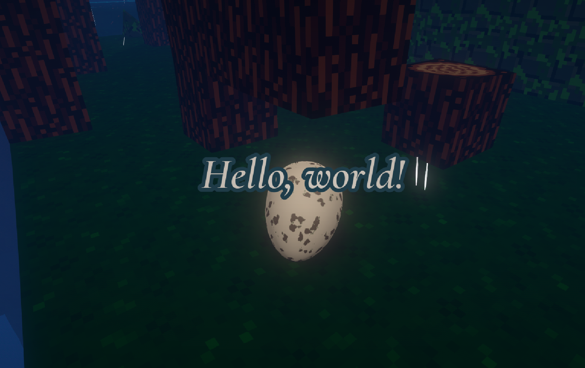

- The game remembers the last message it displayed, and it won't display the same message twice in a row.

#### 5.2.3  KILLBOX 

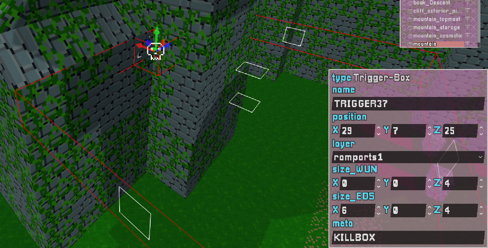

- Special trigger-boxes (drawn red in the map-view for easy identification) that cause the player to die on contact the next time you touch some horizontal-ish level geometry (Ramps should also kill).
- Useful for hazards and boundaries.
- If you enter a killbox, you are internally marked as 'doomed' - you will not trigger any checkpoints in this mode until you restart.

#### 5.2.4  TORCH 
While players are inside the trigger, they emit light. Handy for subtly making dark areas easier to understand without needing to place loads of torch props, which can be expensive/distracting.

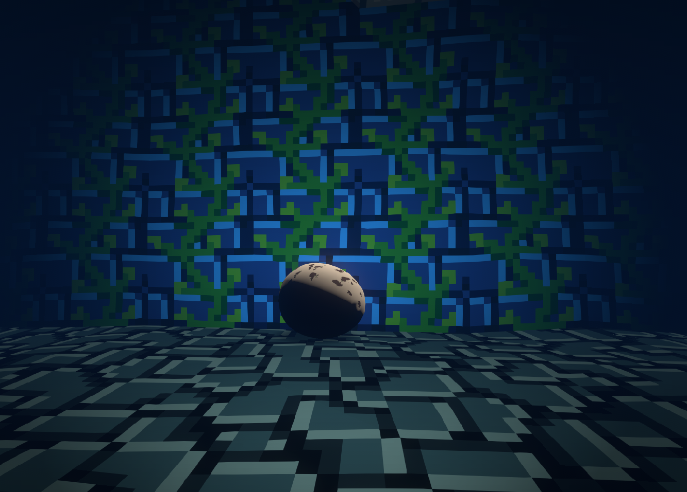

#### 5.2.5 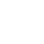 Generic Trigger-Boxes 

There are a few other really finicky trigger-box types - what they do is specified by their meta tags. I don't think they're appropriate for general use, so I won't document them.  It's fine to leave them in the main map if you're modding it, but don't use them in new levels you're building from scratch - they might behave weirdly in ways that are not obvious from their names.

---

## 6. Layer Mode : Large‑Scale Editing

Cycle to Layer Mode with **Backtick** (**`**).

- It can be useful to divide large maps into sections/layers
- Empty layers are shown with a red tint in the layer list so you can spot them easily.

### 6.1 Layer Visibility
- **Shift + Click** a layer to hide all other layers; shift‑click again to restore them.

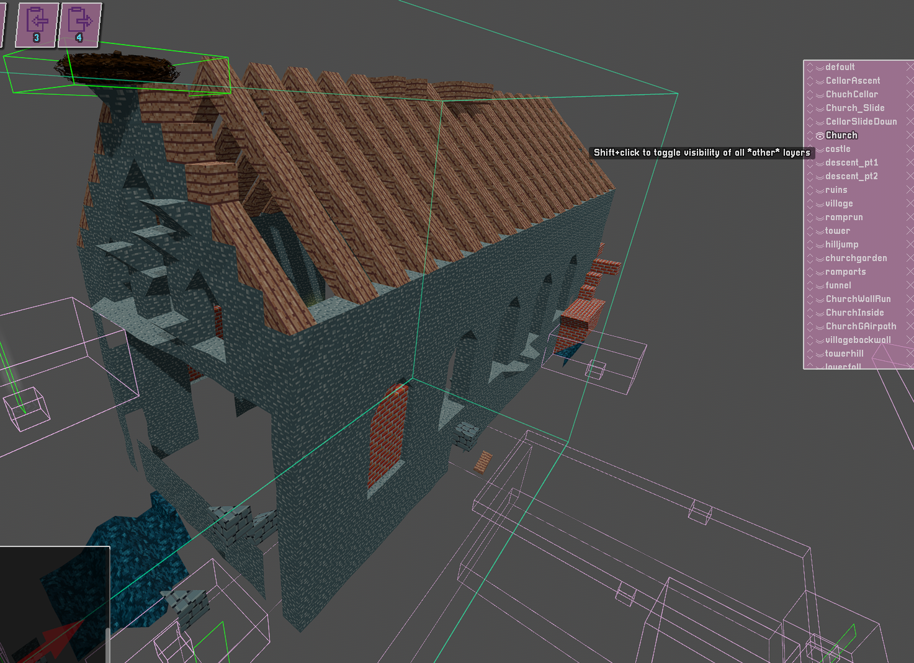

---

### 6.2 Layer Tools

#### 6.2.1  Layer-Transform tool 

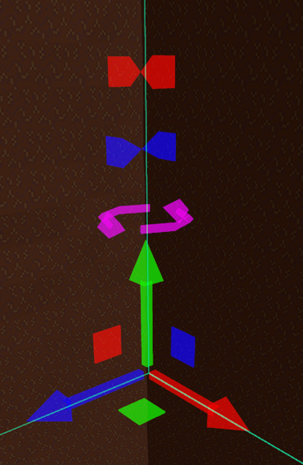

- **Left-Click** to select a layer.
- You can then **move**, **rotate**, or **mirror/flip** the entire layer by clicking or dragging the gizmo.
- Only one block can occupy a single position - if you drag one layer to overlap another, blocks are going to get deleted from one of the layers!

---

#### 6.2.2  Layer-Assignment Tool 

- **Left-Click** and drag out a box : all visible blocks and entities inside get assigned to the currently selected layer.
- **Alt + Left-Click** select highlighted layer.
- Useful for fixing pieces assigned to the wrong layer.

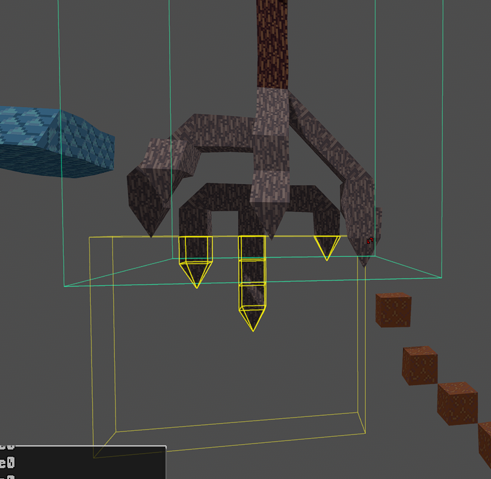

---

### 6.3  Clipboard

- **Left-Click** on a layer to copy it to the clipboard.
- **Right-Click** paste the contents of the  clipboard in the indicated position (the purple box).
- **Ctrl + C** copy the currently selected layer to the clipboard.
- You can copy/paste between different files!

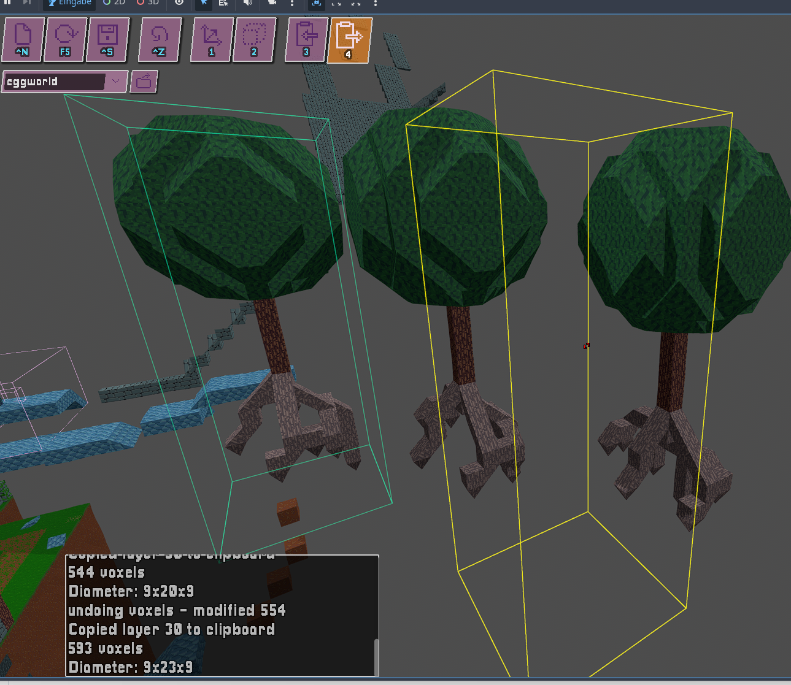

---

## 7. Layer List

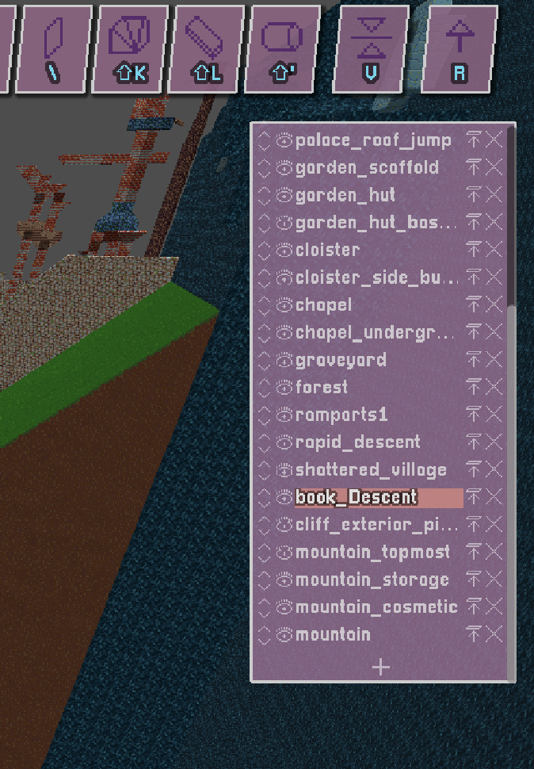

- On the right-hand side of the screen you have the list of layers, with some buttons.
- Empty layers are shown with a red tint in the layer list so you can spot them easily.

### 7.1  Move Layer Up/Down

Rearranges layers.

### 7.2  Visibility

Toggles the visibility of the layer (visible: , hidden: ).

### 7.3  Delete

Deletes the layer.

### 7.4  Merge Up

Merges the layer into the layer above it.

### 7.5  New Layer

Creates a new empty layer.

---

## 8. 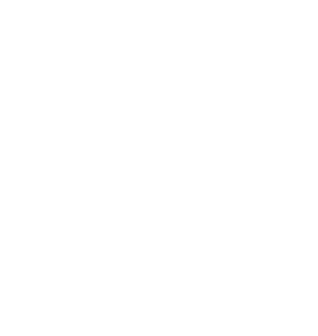 Upload to Steam Workshop

Uploading to Steam Workshop is a pretty easy affair - when you're happy with your level, just hit the steam button in the toolbar :

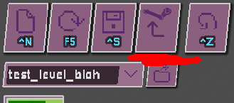

Click on this, and wait for a moment, and you will see a message when the upload is complete, and it should open the Steam Workshop page as well.

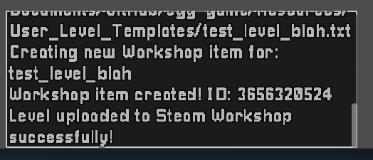

The thumbnail is generated from the view when you hit save.  

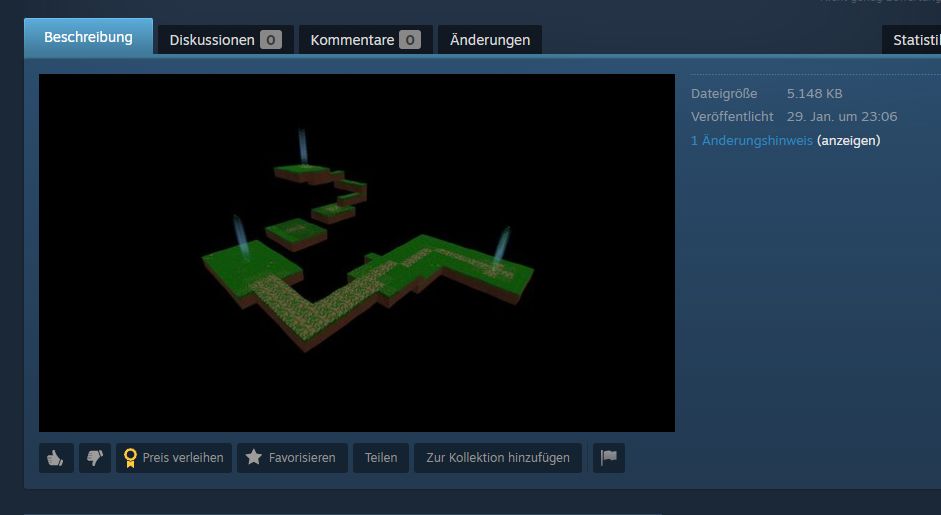

If you wish to customize the details further you can do it from that page.  The mod is associated with the file name of the map - if you resave the file it will update your level on the Steam Workshop.

---

## 9. Feedback and Bug Reports

Does this make sense? I hope so!  Feedback and bug reports always welcome; e-mail me at [analytic@gmail.com](mailto:analytic@gmail.com) .