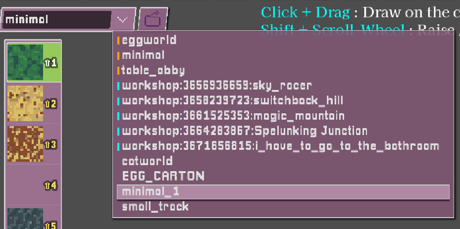

# [OEUF](https://store.steampowered.com/app/3831080/Oeuf/) MAP-EGGITOR TUTORIAL

> **If you prefer a video tutorial, click here : [https://youtu.be/brkR8vVeSMg](https://youtu.be/brkR8vVeSMg)**

## 0. Adding Player-Made Maps

You can add maps manually (if you already have the file) or download them from the Steam Workshop.

### 0.1 Adding Maps Manually

If you have a map file, you can add it like this (doesn't work on Steam Deck!) :

1. Go to **Custom Maps** on the title screen.

2. Click **Open Maps Folder** to open the maps folder in your file manager. You can add map files from other people here.

### 0.2 Adding Maps from Steam Workshop

1. Go to **Custom Maps** on the title screen.
2. Click **Steam Workshop**.

3. On Steam Workshop, you 'subscribe' to things to download them.

4. Once subscribed, maps will appear in the map list and are ready to play :

## 1. Enabling the Map Editor

1. Go to **Settings** :

2. Enable **Map Editor**.
3. Load into a map (custom maps are easiest to work with - the main-game map has some hacky stuff in it).
4. Press **Tab** to open the map editor.

---

## 2. Basic Workflow in the Map Editor

### 2.1 Map-Editor Modes

- **Tab**
    - In-game : Open the Map Editor.
    - In the Map Editor : Toggle mouse control between camera-look and cursor-pointing.
- **Space** : Exit edit mode back into the game, spawning at the point you're aiming at.
- **Backtick** (**`**, likely the key to the left of **1**) : cycle between
    - **Block Mode** : Edit terrain.
    - **Entity Mode** : Checkpoints, props, trigger boxes.
    - **Layer Mode** : Move large sections of terrain.

### 2.2 General Shortcuts

- **Ctrl+S** : Save
- **F5** : Reload
- **Ctrl+Z** : Undo
- **Ctrl+Y** : Redo
- **Ctrl+R** : Randomly rotate all *cube-shaped blocks* with the currently selected texture in the currently selected layer.
- **Ctrl+Shift+R** : Unrandomizes the rotation of all *cube-shaped blocks* (with the currently-selected texture in the currently-selected layer) to face a single direction. Cycles direction each time it's pressed.
- **Ctrl+L** : Open the maps folder with your file manager.
- **Ctrk+K** : Export current level as 3D mesh (for importing into other software/games). This also exports the game tilemap/textures to the same directory.

### 2.3 Loading and Saving

To the top left of the screen you can see :

- The current map name (edit it and press **Enter** to save as a new file).
- The file dropdown. This lists all **built-in maps** (e.g. `minimal`, `eggworld`), **Steam Workshop maps**, and **user maps** (saved in your maps folder).  
- Note : built-in and Steam Workshop maps are *read-only*, but you can save them under new filenames.

---

## 3. Camera and Movement (in the Map Editor)

- **WASD** : Move camera
- **Shift** : Faster movement
- **Q / E** : Move down / up
- **Z / C** : Rotate left / right

(Don't forget : **Tab** toggles between camera-look and cursor-pointing modes.)

---

## 4. Block Tools

<!--nearest neighbour upscaling-->
### 4.1  Basic Block-Placer

- **Click** : Place block.
- **Right-Click** : Delete block.
- **Shift+Click (hold)** : Rapid placement.
- **Shift+Right-Click (hold)** : Rapid deletion.
- **Ctrl+Click** : Place a block offset one step back from the face you're highlighting.
- **Alt+Click** : Sample an existing block (eyedropper).
- **Scroll Wheel** or **Shift+Number Key** : Change the selected block texture in the left toolbar.
- **Ctrl+Scroll Wheel** or **- / =** : Change texture page in the left toolbar.

#### 4.1b Block Shapes

- The top-right toolbar includes ramps and other shapes.
- **R** : Rotate selected shape.
- **V** : Flip vertically.
- Do *not* use the staircase block anywhere the player might roll across it - it doesn't play well with egg physics.

### 4.2  Plane Tool

- **Click+Drag** : Draw a planar sheet (floor or wall).

- **Shift while clicking** : Push the plane one block into the highlighted surface for a flush fit :

- **Right-Click+Drag** : Delete a planar region (useful for doors and openings).

- **Alt while dragging** : Use the initial click point as the *centre* of the plane rather than a corner.

- When using the tool with the 45° slope-shape selected, you drag the plane along the slope :

---

### 4.3  Extrude Tool

- **Click+Drag** to define a 2D area, then move your mouse and **Click** to extrude to that depth.  Very useful!
- Works on irregular shapes :

- **Right-Click+Drag** : Nothing to do with extrude, really, more a "delete everything inside this box" tool.

---

### 4.4  Box Tool

- **Click+Drag** : Create a hollow box.
- **Shift while dragging** : Remove end caps (for tunnels or open boxes).
- **Right-Click** : Carve out a room.

---

### 4.5  Paint Tool

- **Click** : Apply texture to highlighted block.
- **Right-Click** or **Alt+Click** : Sample block texture and shape.
- **Shift+Scroll Wheel** : Adjust brush radius.
- **Shift+Click** : Replace all blocks of the pointed-at texture in the current layer with the selected texture (undoable - but be careful).

---

### 4.6  Hill-Dropper Tool

- **Click** : Drop blocks from above to form organic hills.
- **Right-Click** : Subtract hill-shape from terrain.
- **Scroll Wheel** : Adjust hill height.
- **Shift+Scroll Wheel** : Adjust hill width.
- Useful for mountains and natural terrain; can be used to create 'geological'-looking layers.

---

### 4.7  Sculpt Tool

Grow or shrink your terrain within a sphere.

- **Scroll Wheel** : Control intensity.
    - **Low** : Shrink or erase terrain inside the sphere.
    - **Mid** : Tends to square-off terrain.
    - **High** : Grow existing terrain inside the sphere.
- **Shift+Scroll Wheel** : Adjust brush radius.

---

### 4.8  Sphere Tool

- **Click** : Add a sphere.
- **Right-Click** : Subtract a sphere (good for caves).
- **Shift** : Centre sphere on the point you're highlighting.
- **Scroll Wheel** : Choose texture.
- **Shift+Scroll Wheel** : Change sphere size.

---

### 4.9  Grout Tool

- **Click** : Smooth terrain by filling in edge voxels using intermediate block shapes.
- **Ctrl+Click** : Smooth terrain, but all blocks added use the currently selected texture.
- **Right-Click** : Remove non-cube blocks.
- **Shift+Scroll Wheel** : Change brush size.

---

### 4.10  Planar Drawing Tool

- **Click** : Add a block where you're clicking.
- **Shift+Click** : Add a block on the far side of the plane.
- **Right-Click** : Remove blocks on the plane where you're clicking.
- **Shift+Right-Click** : Remove blocks on far side of the plane where you're clicking.
- **Scroll Wheel+Shift** : Move the plane further/closer to you.
- **Alt+Click** : Sample highlighted block
- **Alt+Right-Click** : Align plane to highlighted face

---

## 5. Entity Mode

Enter Entity Mode by pressing **Backtick** (**`**) until the Entity Mode UI appears.

In Entity Mode there are two tools - the **Object Tool** and the **Trigger-Box Tool**.  Objects are things placed at a single point in the world that you can see, like checkpoints and torches.  Trigger boxes are larger invisible areas that trigger an effect when the player enters them, such as playing a music track or displaying a message.

### 5.1  Object Tool

- **Click** : Place or select an object.
- **Right-Click** : Delete an object.

#### 5.1.1  Start-Checkpoint

- Every map *must* include a **Start-Checkpoint**.
- This is where the player spawns in custom maps; it looks just like a normal checkpoint.
- The `area_name` tag controls the text shown when the player starts a new game on your map.  The default value is `"CUSTOM_LEVEL_LETS_GO"`, a localisation tag that amounts to "Let's go!" in English, but you can change it to whatever message you like.

#### 5.1.2  Normal Checkpoint

- Totally normal checkpoint.
- Set the `area_name` tag to control the text shown when the player activates it.
- You will often want to put checkpoints inside music trigger-boxes so that if a player resumes a saved game, the correct music will play.

#### 5.1.3  End-Checkpoint

- This behaves like a normal checkpoint (only the Nest object can trigger the start/end cutscenes).
- The default `area_name` tag value is `"CUSTOM_LEVEL_YOU_MADE_IT"`, which localises to "You made it!" in English - but you can put whatever you like in there.

#### 5.1.4  Torch

Provides a point of light.  Handy when things are getting a bit dark - but don't overdo it, as each torch adds a light source and the performance cost can add up.

#### 5.1.5  Star

- Makes a satisfying sound when collected, and displays a running count of stars collected vs. the total number of stars on the map.
- Not used in the main game.

#### 5.1.6  Chair

- Inert geometric object.  
- Not used in the main game.

#### 5.1.7  Table

- Inert geometric object.  
- Not used in the main game.

#### 5.1.8 Other Objects

There are other objects accessible via the `asset_name` dropdown in the properties panel, but they have unusual or hard-coded behaviour tied to the main game, so I don't recommend using them in custom maps. (The `Nest.tscn` object, for instance, has a great deal of specific hard-coded logic and spawns invisible collision geometry during cutscenes.) It's fine to leave them in place if you're modding the main game map, just be careful to not modify these objects or their surrounding geometry.

### 5.2  Trigger-Box Tool

- Trigger boxes are big invisible areas that do something (e.g. playing music or displaying a message) when the player enters them.

- In the properties panel you can edit various values, including position and dimensions (WUN = West/Up/North, EDS = East/Down/South) :

- You can also **move** and **resize** trigger boxes in the viewport using the **move gizmo** and **face resize handles** (drag the coloured handles on each face of the box).

- Note that each trigger box has a 1×1×1 'core' that you click to select it. (Technically this core doesn't need to be inside the trigger area, but...why would you do that?)

#### 5.2.1  music

- Starts playing a music track when the player enters.
- Usually you want to have a music trigger at each checkpoint so that the correct music plays when a player resumes a saved game.
- Choose the track from the dropdown in the properties panel.

- Any time you select a music trigger-box, you'll hear a preview of its music.
- You can't add your own music files, but in addition to the main OST there are several hours of bonus tracks included for use in custom maps.
- The OST is [here](https://store.steampowered.com/app/4217410/Oeuvre_Oeuf_Soundtrack/) if you want to listen to it outside the game.

#### 5.2.2  arealabel

'arealabel' trigger boxes display a message on screen when the player enters, independently of checkpoints.  If the `area_name` matches a built-in location name (case-sensitive), the game localises it - e.g. entering `FOREST` displays "Forest of Branching Paths" in English.  Otherwise it just displays your text verbatim, so entering `Hello, world!` displays "Hello, World!".

#### 5.2.3  KILLBOX

- If you enter a killbox, you are internally marked as *doomed*, and will oof the next time you touch horizontal-ish map geometry (ramps included).
- Drawn in red in the map view for easy identification.
- While *doomed*, you cannot trigger checkpoints until you restart.

#### 5.2.4  TORCH

While inside this trigger box, the player emits light.  Handy for subtly brightening dark areas without placing lots of torch props (which can be expensive to render and visually distracting).

#### 5.2.5  Generic Trigger-Boxes

There are a few other really finicky trigger-box types - what they do is specified by their meta tags.  I don't think they're appropriate for general use, so I won't document them.  If you're modding the main game map it's fine to leave them in place - but pls don't use them in maps you're making from scratch, as they may behave unexpectedly.

---

## 6. Layer Mode

Cycle to Layer Mode with **Backtick** (**`**).

- It can be useful to divide large maps into layers.
- Empty layers are shown with a red tint in the layer list so you can spot them easily.

### 6.1 Layer Visibility

- **Shift+Click** a layer to hide all other layers; **Shift+Click** again to restore them.

---

### 6.2 Layer Tools

#### 6.2.1  Layer Transform Tool

- **Click** : Select a layer.
- You can then **move**, **rotate**, or **mirror/flip** the entire layer using the gizmo.
- Note : only one block can occupy a given position - if you drag one layer to overlap another, blocks are going to get deleted from one of the layers!

---

#### 6.2.2  Layer Assignment Tool

- **Click** and drag out a box : All visible blocks and entities inside get assigned to the currently selected layer.
- **Alt+Click** : Select the highlighted layer.
- Useful for correcting blocks assigned to the wrong layer.

---

### 6.3  Clipboard

- **Click** on a layer to copy it to the clipboard.
- **Right-Click** : Paste the clipboard contents in the indicated position (shown as a purple box).
- **Ctrl+C** : Copy the currently selected layer to the clipboard.
- You can copy and paste between different map files!

---

## 7. Layer List

To the right-hand side of the screen you have the layer list, with the following buttons :

### 7.1  Move Layer Up / Down

Rearranges layers.

### 7.2  Visibility

Toggles the visibility of the layer (visible : , hidden : ).

### 7.3  Delete

Deletes the layer.

### 7.4  Merge Up

Merges the layer into the layer above it.

### 7.5  New Layer

Creates a new empty layer.

---

## 8.  Upload to Steam Workshop

When you're happy with your map and want to share it on the Steam Workshop, click the Steam button in the toolbar :

After a moment, you'll see a confirmation message and the Steam Workshop page for your map will open automatically.

The thumbnail is generated from a screenshot of the current view when you save.

If you'd like to customise the listing further, you can do so from that page.  The mod is associated with the file name of the map - if you resave the file it will update your map on the Steam Workshop.

---

## 8. Level file format specs

Oeuf stores its levels as plaintext, with space-separated values.  Each line starts with a token which indicates the type of data stored, and then information about it.  This is not a comperhensive spec, the idea is to give you enough to get started parsing/generating if you want to.  Happy to explain more if you want to know more.  Just drop me an email.

- **version** VERSION_NUMBER
    - **VERSION_NUMBER** : the version number of the level file format. 
- **voxels** voxelcount : how many voxels are in the level.
- **vx** A B C D E F G H I
    - **vx** : "this is a voxel"
    - **A** : 1 if what follows is an absolute coordinate, or 0 if given relative to the last-specified coordinate (saves file size a lot!)
    - **BCD** : (x,y,z) coordiante of voxel (either absolute or relative depending on above)
    - **E** : block shape index
    - **FG** : tilemap coordinates
    - **H** : rotation encoded as (rot + vflip * 4) (vflip = if vertically flipped)
    - **I** : layer index
- **layers** layercount : how many layers are in the level.
- **l** LAYER_NAME VISIBILITY
- **selected** SELECTED_LAYER_INDEX
- **cp** X Y Z : editor camera position
- **cbr** X Y Z : editor camera base rotation
- **crr** X Y Z : editor camera rot rotation (cbr and crr just encode rotations of the camera dn its parents, can't be bothered to check up what exactly they are)
- **entities_version** ENTITY_VERSION_NUMBER : version number of the entity section.
- **entities** entitycount : number of entities
- **e** ENTITY_NAME ENTITY_TYPE X Y Z LAYER FLAGS [...FLAG-DEPENDENT FIELDS]
    - **e** : "this is an entity"
    - **ENTITY_NAME** : entity name, surrounded by double-quotes
    - **ENTITY_TYPE** : entity type (integer).  `3` means a trigger-box (see below)
    - **X Y Z** : entity position (x y z)
    - **LAYER** : entity layer (present in `entities_version >= 3`)
    - **FLAGS** : bitfield controlling which optional fields follow (immediately after **FLAGS**)
        - If **bit0** (value **1**) is set : include **DIR_PLUS_ONE** (stores **dir+1**)
        - If **bit1** (value **2**) is set : include **"META"**
        - If **bit2** (value **4**) is set : include **"ASSET_NAME"** (e.g. **"Bonfire.tscn"**)
        - If **bit3** (value **8**) is set : include **COLOUR** (unsigned byte)
    - If **ENTITY_TYPE** is **3** (trigger-box), the line also includes two extra vectors at the end:
        - **size_EDS** : east/down/south extents (x y z)
        - **size_WUN** : west/up/north extents (x y z)

---

## 9. Feedback and Bug Reports

Does this make sense? I hope so! Feedback and bug reports are always welcome - e-mail me at [analytic@gmail.com](mailto:analytic@gmail.com).
