# [OEUF](https://store.steampowered.com/app/3831080/Oeuf/) MAP EGGITOR TUTORIAL

If you prefer a video version of the tutorial, here's one : https://youtu.be/BCKunr3oAbc

## Contents
* [0. Adding Player-Made Maps](#0-adding-player-made-maps)
* [1. Enabling the Editor](#1-enabling-the-editor)
* [2. Basic Workflow in Editor](#2-basic-workflow-in-editor)
* [3. Camera and Movement (Editor Mode)](#3-camera-and-movement-editor-mode)
* [4. Voxel Tools](#4-voxel-tools-)
* [5. Object Mode (Entities and Trigger-Boxes)](#5-object-mode--entities-and-trigger-boxes)
  * [5.1 Entity Tool](#51-entity-tool-img-height40-srcmap-editor-imagesd7c0fbfe-3b7f-4003-b53a-f00957440e98png-)
  * [5.2 Trigger-Box Tool](#52-trigger-box-tool-img-height40-altimage-srcmap-editor-imagestrigger_box_toolpng-)
* [6. Layer Mode (Large‑Scale Editing)](#6-layer-mode--large‑scale-editing)
  * [6.1 Layer Visibility](#61-layer-visibility)
  * [6.2 Layer Tools](#62-layer-tools)
* [7. Upload to Steam Workshop](#7-upload-to-steam-workshop)
* [8. Feedback and bug reports](#8-feedback-and-bug-reports)

## 0. Adding Player-Made Maps

There are two ways to add maps by other people - if you already have the file, you can add it manually, or if you want to download it from steam workshop, you can do that too.

### 0.1 Adding Maps Manually

If you have a map file, you can add it like this : (doesn't work on Steam Deck!)

1. Go to **Custom Maps** on the title screen

2. Go to **Open Maps Folder** to open the maps folder in your file manager. You can add map files that you have gotten from other people here.

### 0.2 Adding Maps from Steam Workshop

1. Go to **Custom Maps** on the title screen

2. Click on **Steam Workshop**

3. On Steam Workshop, you 'subscribe' to things to download them.  

4. Once you've done that, they should just be visible in the map list to play.

## 1. Enabling the Editor
1. Open **Settings** :

2. Enable **Map Editor**.
3. Load into a level (custom levels are easiest to work with - the main game level has hard-coded stuff).
4. Press **Tab** to open the editor.

---

## 2. Basic Workflow in Editor

### Editor Modes :

- **Tab** :
  - If you're in-game, it opens the map editor!
  - In editor mode, it toggles mouse control between camera-look and cursor-pointing.
- **Space** : Exits edit mode and spawns you where you're pointing at.
- **Backtick** (**`**, or whatever key is to the left of the '1' on your keyboard) to cycle between :
  - **Voxel Mode** (editing terrain)
  - **Object Mode** (checkpoints, props, trigger-boxes)
  - **Layer Mode** (moving large sections of terrain)

### General commands :

- **Ctrl + S** save
- **F5** reload
- **Ctrl + Z** undo
- **Ctrl + Y** redo
- **Ctrl + R** : randomly rotates all cubes with the currently-selected tile-graphic in the currently-selected layer.

In the top left of the screen you can see :

* the current file name (change and press enter to save as a new file)
  * (note : some built‑in maps are read‑only (e.g., `minimal`, `eggworld`). You can save them under other files names OK though!)
* the dropdown menu shows all built-in maps files, and those you have saved in your level folder.
* the button to open up the levels folder (shortcut : **Ctrl + L**).

---

## 3. Camera and Movement (Editor Mode)
- **WASD** : Move camera
- **Shift** : Faster movement
- **Q / E** : Up / Down
- **Z / C** : Rotate Left / Right
- (don't forget : **TAB** toggles camera/cursor mouse-modes)

---

## 4. Voxel Tools :

<!--nearest neighbour upscaling-->
### 4.1 Basic Voxel Placer 
- **Left click** : Place block.
- **Right click** : Delete block.
- **Shift + left click (hold)** : Rapid placement.
- **Shift + right click (hold)** : Rapid deletion.
- **Ctrl + left click** : Place a block one tile removed from the face you're targeting.
- **Alt + click** : Sample an existing block (eyedropper).
- **Scroll-Wheel** or **Shift+number keys** : Change current tile.
- **Ctrl + scroll-wheel** or **- / +** : Change tile page.

### 4.1b (Aside : Voxel Shapes and Rotation) 

- The top-right toolbar includes ramps and other shapes.
- **R** : Rotate selected shape.
- **V** : Flip vertically.
- The shortcuts are as listed above - note that an underscore **_** means to hold **Shift** while pressing the named key.
- If you're drawing a plane and have the 45° slope selected, you drag the plane along the slope :

- Do *not* use the staircase block anywhere where the player might roll across it - it does not play well with egg physics.

### 4.2 Plane-Drag / Wall Tool 

- **Left click + drag** to draw a planar sheet (floor or wall).

- **Shift while dragging** : Push the plane one voxel into the target surface for a flush surface :

- **Right click + drag** : Delete a planar region (good for making doors/openings)

- Holding **Alt** while doing the above causes the initial point you click to be the *centre* of the plane rather than the corner.

---

### 4.3 Extrude Tool 
- **Select an area**, then **drag** to extrude it outward.
- Works on irregular shapes :

- **Right‑click variant** deletes large cuboids for cleanup. Nothing to do with extrude, really, more a "delete everything in this volume" tool.

### 4.4 Room / Box Tool 

- **Click + drag** to create a hollow rectangular volume.
- **Shift while using** : Removes end caps (for tunnels / open boxes).

### 4.5 Paint Tool 

Paints existing voxels.

- **Alt + click** : Sample tile (including shape).
- **Click** : Repaint.
- **Shift + scroll-wheel** : Adjust brush radius.
- **Shift + click** : Replace all tiles of the pointed-at graphic in the current layer with the selected tile (undoable, but be careful).

---

### 4.6 Landscape / Hill-Dropper Tool 
- Drops blocks from above to form organic hills.
- **Scroll-Wheel** : Hill height.
- **Shift + scroll-wheel** : Hill width.
- Useful for mountains and natural terrain; can be used to create 'geological'-looking layers.

---

### 4.7 Grow / Shrink Tool 

Spherical modifier with an intensity meter (controlled with **Scroll-Wheel**) :

  - Low setting : shrink/erase inside the sphere.
  - High setting : grow/extrude outward.
  - Mid setting : tends to square off shapes.
- **Shift + scroll-wheel** : Adjust brush radius.

---

### 4.8 Add / Subtract Sphere Tool 

Adds/removes a sphere!

- **Scroll-Wheel** : Choose tile.
- **Shift + scroll-wheel** : Change sphere size.
- **Left click** : Add a sphere.
- **Shift + left click** : Centre sphere on cursor point.
- **Right click** : Subtract a sphere (good for caves).

---

### 4.9 Smooth / Grout Tool 

- **Click** : Smooth terrain by inserting appropriate edge pieces (using one of the neighbouring textures).
- **Shift + scroll-wheel** : Change brush size.
- **Shift + click** : Grout mode; fills seams using the current tile instead of smoothing.

---

### 4.10 Planar-Draw Tool 
- **Click** and drag to draw on the current plane.
- **Shift + scroll-wheel** raises and lowers the drawing plane.

---

## 5. Object Mode : Entities and Trigger-Boxes
Enter Object Mode by pressing **backtick** (if you have a different keyboard layout, it should still be whatever button is to the left of the 1 key on the top-left of your keyboard) until the Object UI appears.

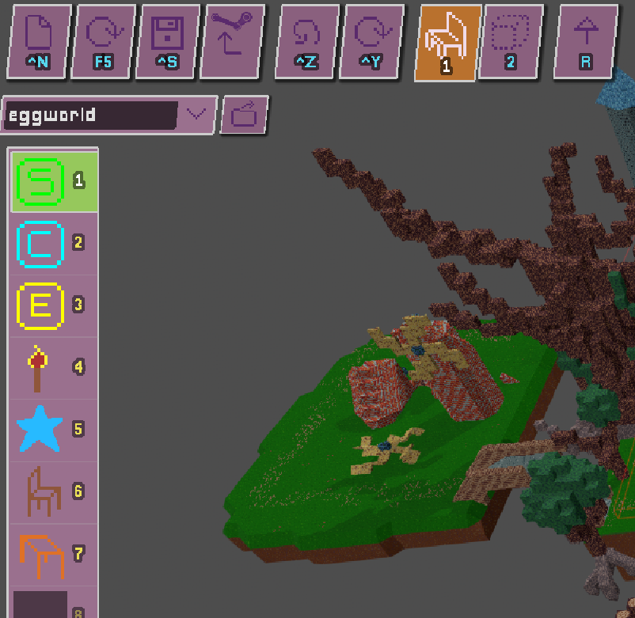

In Object Mode there are two tools - *entity* placement and *trigger-box* placement.  Entities are things that are placed in the world that you can see and generally just occupy a single tile, like checkpoints and torches.  Trigger-boxes are larger areas, invisible to the player, where something happens if you enter them, like playing a music track, or displaying a message. 

### 5.1 Entity Tool 

This mode has two brushes, one for placing entities, another for placing trigger-boxes.  

- **Left Click** to place/select
- **Right Click** to delete
   
####  5.1.1 Start-Checkpoint 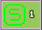
- Every level must include a start checkpoint.
- This is where the player spawns in custom levels, but looks just like a normal checkpoint.
- The area_name tag is what text gets shown when you spawn into the level. By default the value is "CUSTOM_LEVEL_LETS_GO", which is a specific localized key that is "Let's go!" in English.
- (The 'Nest.tcsn' asset can also function as a 'start' checkpoint, but its behaviour has a lot of hard-coded nonsense in it so I don't recommend using it in your own levels, unless they mod the regular game - and even then, be careful to test it and not modify the geometry around the starting area too much)

#### 5.1.2 Normal Checkpoint 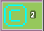
- Totally normal checkpoint.
- You can set the area_name tag to whatever you want to display when the player activates it.
- If you want to trigger music when you reach the point, or spawn back to it, you have to use a music trigger-box for that.

#### 5.1.3 End-Checkpoint 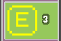
- Unlike the main game, custom levels don't really have a proper final checkpoint (unless they use the nest).  This is just a normal checkpoint really.
- By default the area_name tag is "CUSTOM_LEVEL_YOU_MADE_IT", which is localized to "You made it!" in English. But you can put whatever you want in there.

#### 5.1.4 Torches 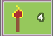

- What it looks like.  Nice if things are getting a bit dark innit.
- But don't overdo it, each torch has a light and the cost might add up.

#### 5.1.5 Star 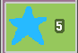

- Makes a nice sound when you collect them and shows you how many you've collected vs total in the level.
- Totally optional and of no consequence (I implemented these thinking I might want to put them in the main game, but decided better of it in the end).

#### 5.1.6 Chair 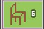

Just a bit of geometry.  Not used in the main game.

#### 5.1.7 Table  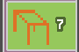

Just a bit of geometry.  Not used in the main game.

#### 5.1.8 Other entities

There are other objects in the game, accessible via the asset_name dropdown in the object info panel, but they contain weird/hacky behaviour specific to the main game, so I don't recommend using them.  Stuff like the Nest.tscn object that just has a lot of hard-coded and very particular behaviour that I don't want to explain.  However, modifying the main game map should be safe enough, even though it contains these objects - just be careful of modifying these objects or their surroundings in-game if you come across them!

### 5.2 Trigger-Box Tool 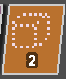

- Trigger-boxes are big invisible areas that do something when the player enters them.

- In the sidebar you can edit various properties, including their position and dimensions (WUN=West/Up/North, EDS=East/Down/South):

- You can also **move** and **resize** trigger-boxes in the viewport using the **move gizmo** and **face resize handles** (drag the coloured handles on each face of the box).

#### 5.2.1 music 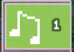
- This causes music to play if you enter it.  
- Usually you want to have a music trigger at each checkpoint, so that if a player resumes a save game, there'll automatically be the right music playing.
- You can choose the music track from a dropdown list in the properties panel.

- Any time in the editor you click on a music trigger you'll hear a preview of its music.
- You can't include your own music files. However in addition to the core OST of the game, there are several hours of bonus tracks included for people who want to make their own levels to use.
- The Music OST is [here](https://store.steampowered.com/app/4217410/Oeuvre_Oeuf_Soundtrack/) if you want to listen to it casually.

#### 5.2.2 arealabel 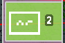

- Arealabel trigger-boxes show a message on screen when the player enters, independently of checkpoints. If the 'area name' is a built-in location name (case-sensitive), the game displays that location name (and will localise it. e.g. if you enter "FOREST" the text will be "Forest of Branching Paths"); otherwise it displays your text verbatim. So if you enter `Hello, world!` as your area name, it displays "Hello, World!".

- The game remembers the last message it displayed, and it won't display the same message twice in a row.

#### 5.2.3 KILLBOX 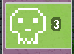

- Special trigger-boxes (drawn red in the editor for easy identification) that cause the player to die on contact the next time you touch some horizontal-ish level geometry (Ramps should also kill).
- Useful for hazards and boundaries.

#### 5.2.4 TORCH 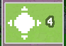
- While players are inside the volume, they emit light. Handy for subtly making dark areas easier to understand without needing to place loads of torch props, which can be expensive/distracting.

#### 5.2.5 Generic trigger-boxes 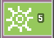

- There are a few other really finicky trigger-box types - what they do is specified by their meta tags. I don't think they're appropriate for general use, so I won't document them.  It's fine to leave them in the main map if you're modding it, but don't use them in new levels you're building from scratch - they might behave weirdly in ways that are not obvious from their names.

---

## 6. Layer Mode : Large‑Scale Editing

Cycle to Layer Mode with **Backtick** (**`**).

- It can be useful to divide large maps into sections/layers
- Empty layers are shown with a red tint in the layer list so you can spot them easily.

### 6.1 Layer Visibility
- **Shift + click** a layer to hide all other layers; shift‑click again to restore them.

---

### 6.2 Layer Tools

#### 6.2.1 Layer Selection/Transformation tool 

- Use the layer selection tool to pick a layer by clicking geometry.
- You can then **move**, **rotate**, or **mirror/flip** the entire layer.
- Only one voxel can occupy a single position - if you drag one layer to overlap another, voxels are going to get deleted from one of the layers!

---

#### 6.2.2 Voxel Assignment Tool 

- Drag a volume; all voxels inside become part of the currently selected layer.
- Useful for fixing pieces assigned to the wrong layer.

---

### 6.3 Copy/Paste Layers

- Copy a selected layer/group and paste it as a brush.
- Select the Copy tool (3) and click anywhere to copy the current layer to the clipboard.
- Select paste and move (not rotate) your camera - note that you can now see the outline of the layer move with your camera - click to paste a copy of the copied layer.
- You can copy/paste between different files!

---

## 7. Upload to Steam Workshop

Uploading to Steam Workshop is a pretty easy affair - when you're happy with your level, just hit the steam button in the toolbar :

Click on this, and wait for a moment, and you will see a message when the upload is complete, and it should open the Steam Workshop page as well.

The thumbnail is generated from the view when you hit save.  

If you wish to customize the details further you can do it from that page.  The mod is associated with the file name of the map - if you resave the file it will update your level on the Steam Workshop.

---

## 8. Feedback and bug reports

Does this make sense? I hope so - feedback and bug reports always welcome : e-mail me at analytic@gmail.com .