# [OEUF](https://store.steampowered.com/app/3831080/Oeuf/) MAP-EGGITOR TUTORIAL

> **If you prefer a video tutorial, click here : [https://youtu.be/brkR8vVeSMg](https://youtu.be/brkR8vVeSMg)**

## 0. Adding Player-Made Maps

You can add maps manually (if you already have the file) or download them from the Steam Workshop.

### 0.1 Adding Maps from Steam Workshop

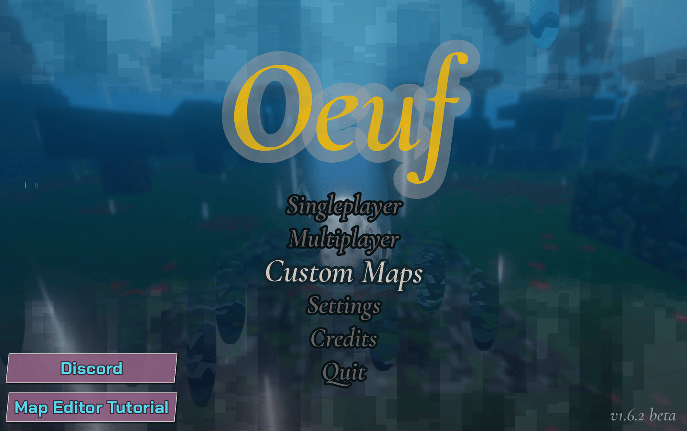

1. Go to **Custom Maps** on the title screen.
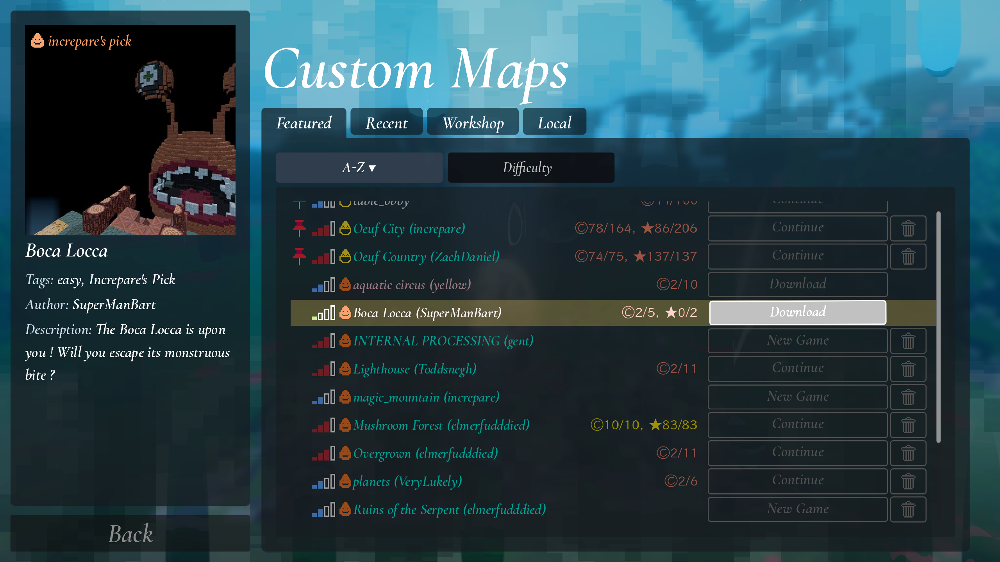

2. From here you can download maps from the steam workshop - the default 'Featured' tab displays my own personal picks, and you can browse and download many more in the other tabs. 

### 0.2 Adding Maps Manually

If you have a map file (.txt or .zip), you can add it like this (doesn't work on Steam Deck!) :

1. Go to **Custom Maps** on the title screen.
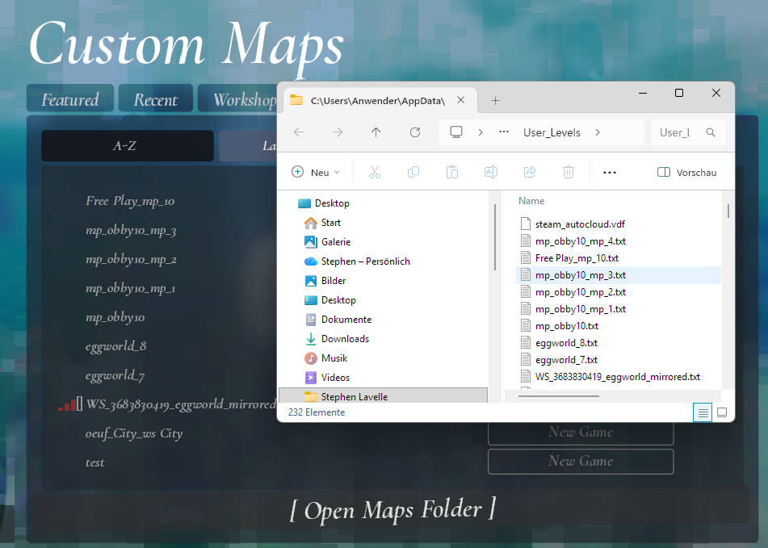

2. In the **Local** tab, click **Open Maps Folder** to open the maps folder in your file manager.  You can add map files from other people by dragging them here.

## 1. Enabling the Map Editor

1. Go to **Settings** :
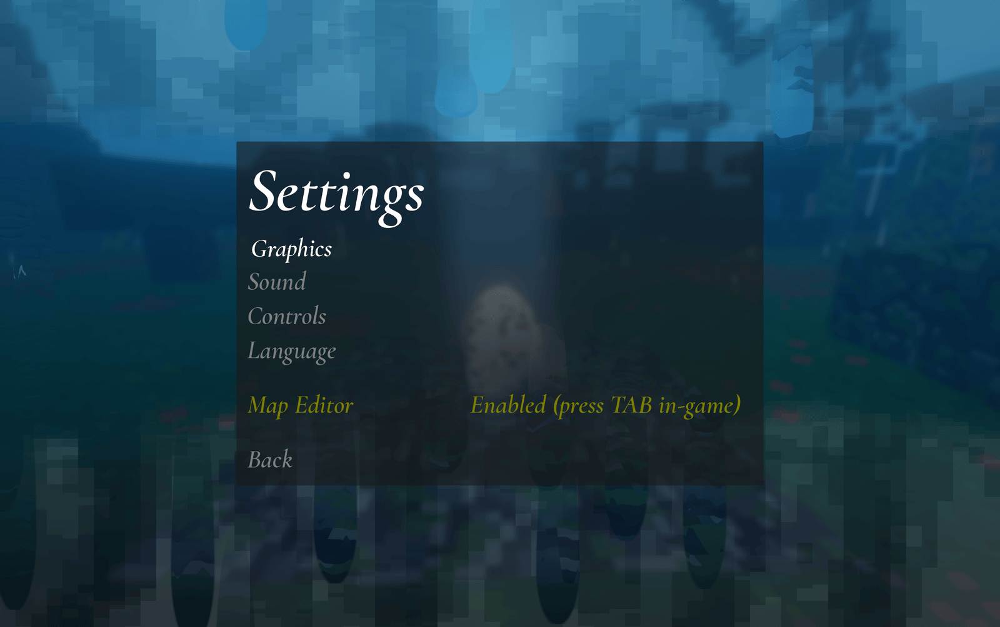

2. Enable **Map Editor**.
3. Load into a map (custom maps are easiest to work with - the main-game map has some hacky stuff in it).
4. Press **Tab** to open the map editor.
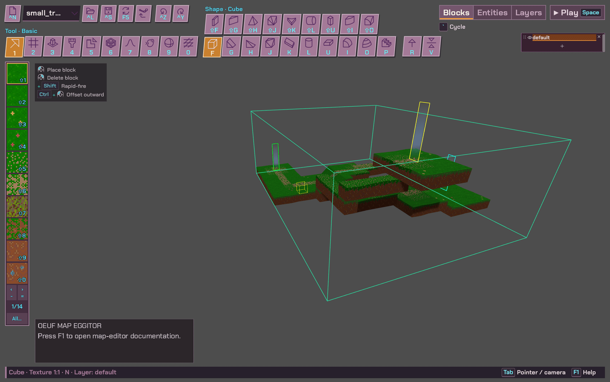

---

## 2. Basic Workflow in the Map Editor

### 2.1 Map-Editor Modes

- **Tab**
    - In-game : Open the Map Editor.
    - In the Map Editor : Toggle between controlling the camera with your mouse, or having a free cursor to click on things with.
- **Space** : Exit edit mode back into the game, spawning at the point you're aiming at.
- **Backtick** (**`**, likely the key to the left of **1**) : Cycle between
    - **Block Mode** : Edit terrain.
    - **Entity Mode** : Checkpoints, props, trigger boxes.
    - **Layer Mode** : Move large sections of terrain.
- You can also switch modes with the **Blocks** / **Entities** / **Layers** buttons in the top-right corner.
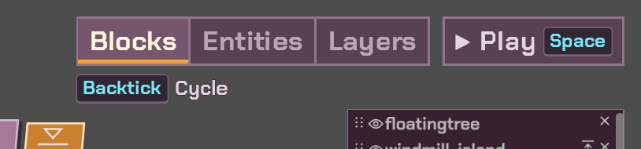

### 2.2 General Shortcuts

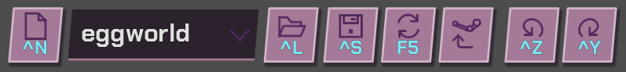
(On a Mac, use **Cmd** wherever it says **Ctrl**.)

- **Ctrl+N** : New map
- **Ctrl+L** : Open the local maps folder in your file manager.
- **Ctrl+S** : Save
- **F5** : Reload
- **Ctrl+Z** : Undo
- **Ctrl+Y** : Redo
- **Ctrl+R** : Randomly rotate all *cube-shaped blocks* with the currently selected texture in the currently selected layer.
- **Ctrl+Shift+R** : Unrandomizes the rotation of all *cube-shaped blocks* (with the currently-selected texture in the currently-selected layer) to face a single direction.  Cycles direction each time it's pressed.
- **Ctrl+K** : Export current map as a 3D mesh (for importing into other software/games).  This also exports the game tilemap/textures to a .png file in the same directory.
- **F1** : Open this tutorial.
- **F12** : Take a screenshot (saved to your operating system's pictures folder in the Oeuf directory).

### 2.3 Loading and Saving

To the top left of the screen you can see :

- The current map name (edit it and press **Enter** to save as a new file).
- The file dropdown.  This lists all **built-in maps** (e.g. `minimal`, `eggworld`), **Steam Workshop maps**, and **local maps** (saved in your maps folder).  
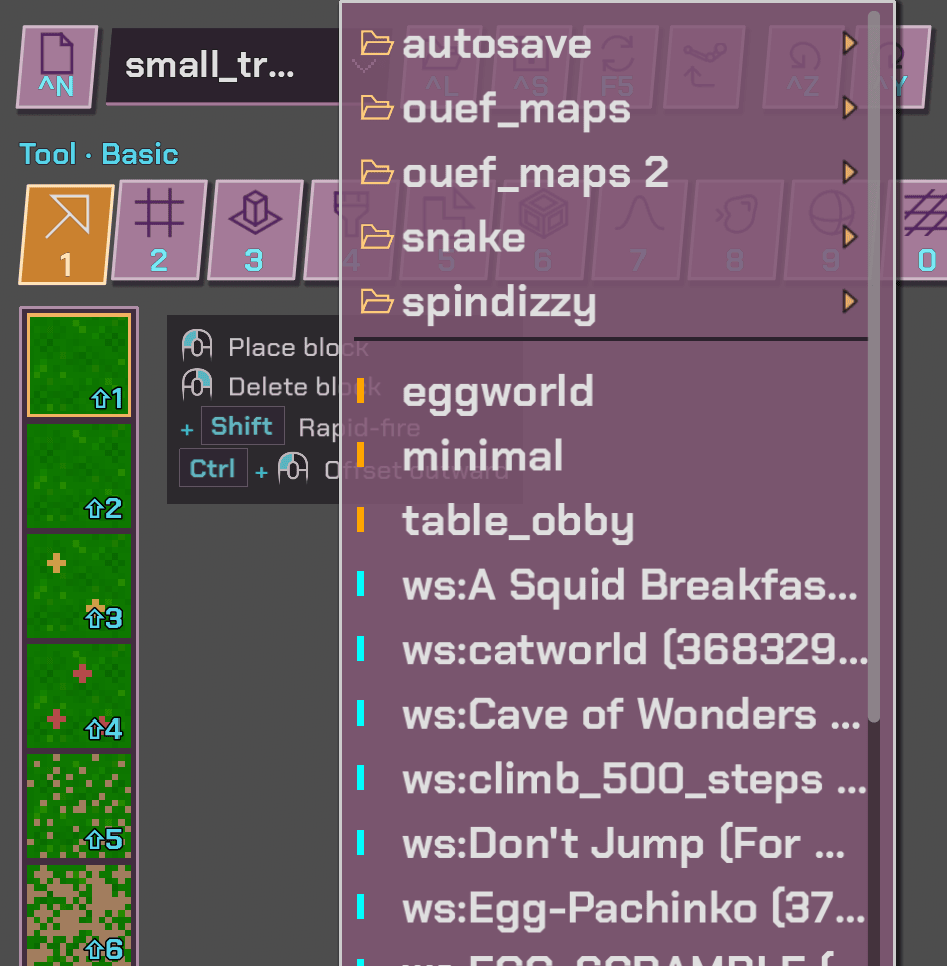
- Built-in and Steam Workshop maps are *read-only*, but you can save them under new filenames.
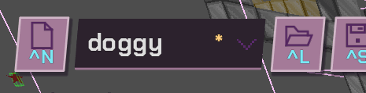
- An asterisk after the map name means you have unsaved changes.  The editor also keeps recovery autosaves (in the `autosave` folder inside your maps folder), but these don't replace saving.

---

## 3. Camera and Movement (in the Map Editor)

- **W, A, S, D** : Move camera
- **Q, E** : Move down / up
- **Z, C** : Rotate left / right
- **Shift (hold)** : Faster movement

(Don't forget : **Tab** toggles between camera-look and cursor-pointing modes.)

---

## 4. Block Tools

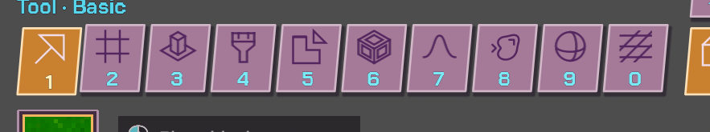

### 4.0 Universal Shortcuts

The following shortcuts work in all block tools :

- **Wheel**, or **Shift+Number Key** : Change the selected block texture in the left toolbar.
- **Ctrl+Wheel**, or **- / =** : Change texture page in the left toolbar.
- **Alt+Click**, or **Middle-Click** : Sample whatever you're pointing at; the block (texture, shape, direction), entity or layer, depending on the mode. 

<!--nearest neighbour upscaling-->
### 4.1  Basic Tool

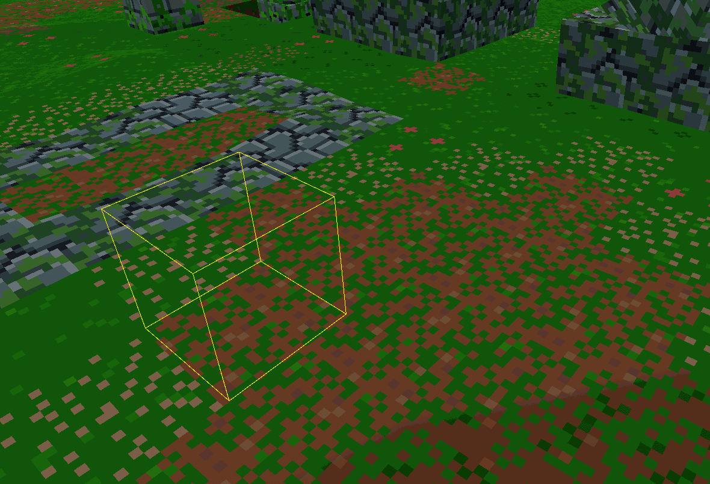

- **Click** : Place block.
- **Right-Click** : Delete block.
- **Shift (hold)** : Keep adding (or subtracting) blocks as you move the cursor.
- **Shift+Right-Click (hold)** : Rapid deletion (as you move the cursor).
- **Ctrl+Click** : Place a block offset one step back from the face you're highlighting.

#### 4.1b Block Shapes

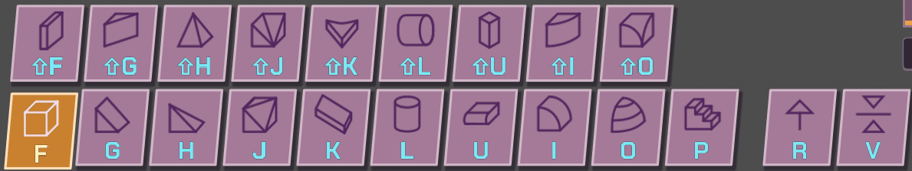

- The shape toolbar, to the right of the tools, includes ramps and other shapes.
- **F**, **G**, **H**... and **Shift+F**, **Shift+G**, **Shift+H**... : Select a shape (each shape's key is shown on its button).
- **Ctrl+Shift+Wheel** : Cycle through the shapes.
- **R** : Rotate selected shape about the vertical axis.
- **V** : Flip vertically.

> [!WARNING]
> Do *not* use the staircase block anywhere the player might roll across it - it doesn't play well with egg physics.

### 4.2  Plane

- **Click+Drag** : Draw a planar sheet (floor or wall).
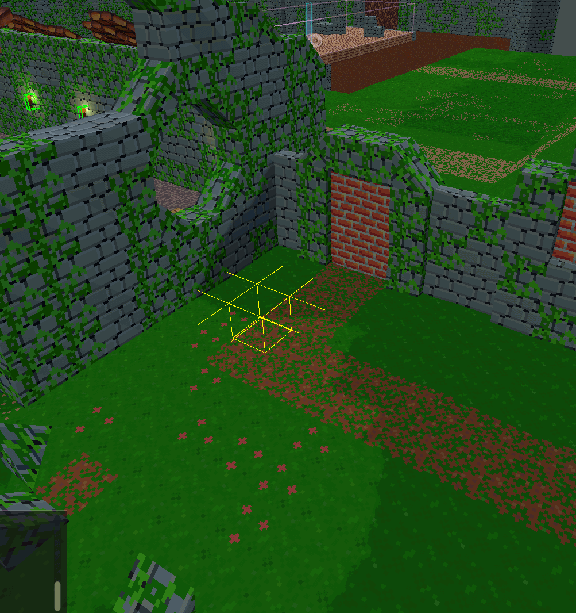

- **Ctrl while clicking** : Push the plane one block into the highlighted surface for a flush fit :
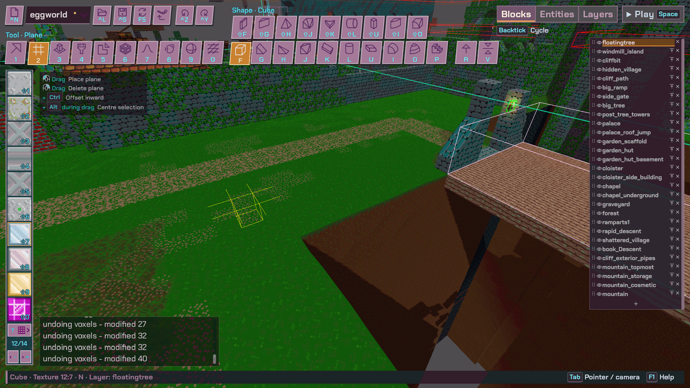

- **Right-Click+Drag** : Delete a planar region (useful for doors and openings).
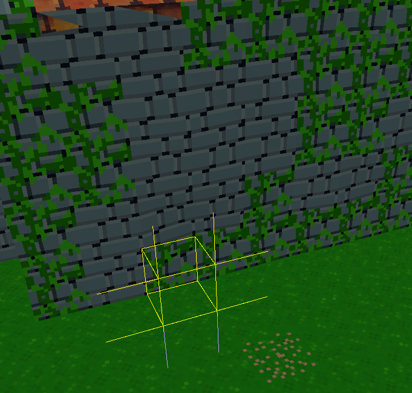

- **Alt while dragging** : Use the initial click point as the *centre* of the plane rather than a corner.
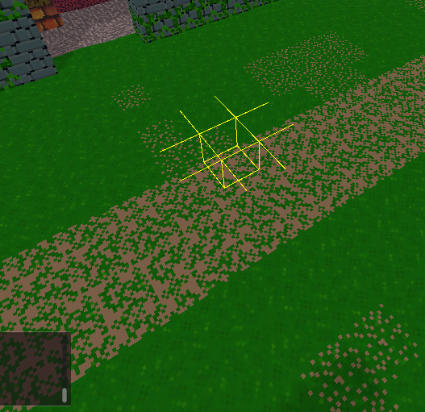

- When using the tool with the 45° slope-shape selected, you drag the plane along the slope :
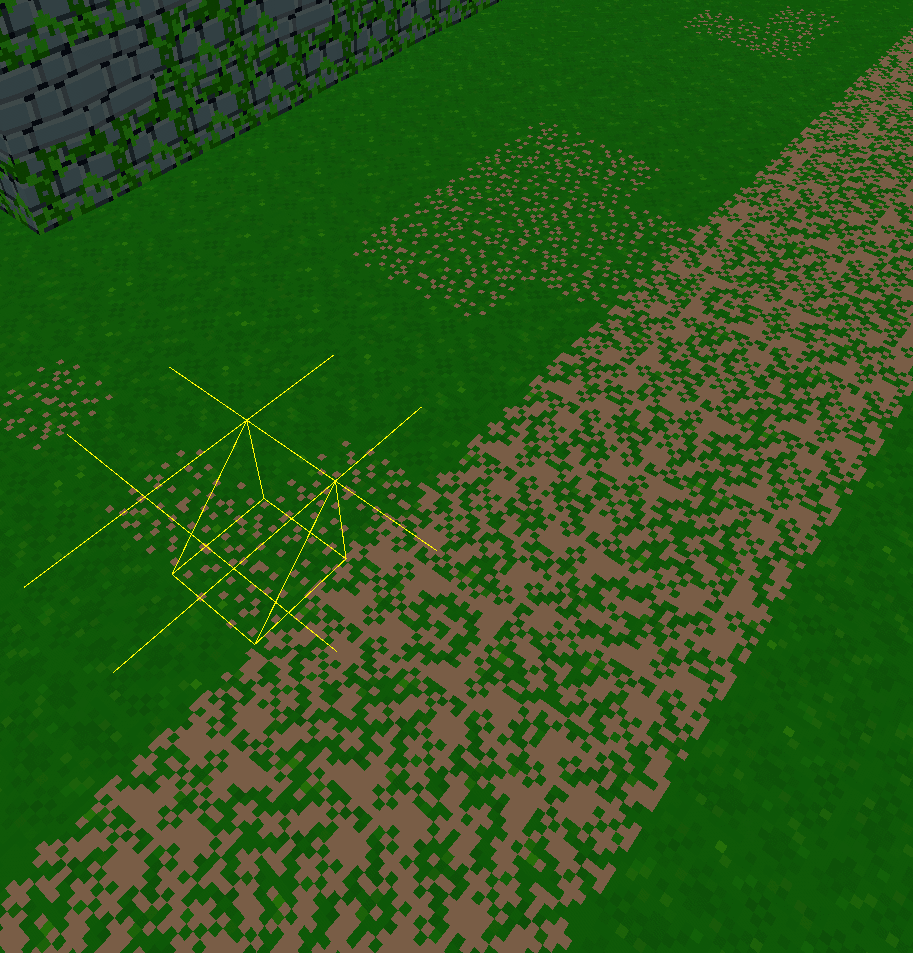

---

### 4.3  Extrude

- **Click+Drag** to define a 2D area, then move your mouse and **Click** to extrude to that depth.  Very useful!
- Works on irregular shapes :
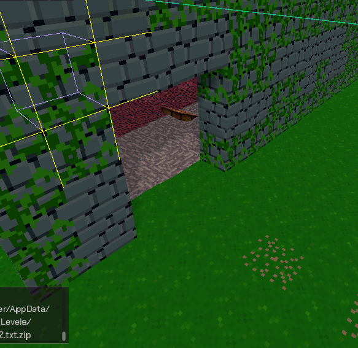

- **Shift+Click** : Extrude using the currently selected texture.
- **Alt while dragging** : Use the initial click point as the *centre* of the area rather than a corner.
- **Right-Click+Drag** (then **Click** to set the depth) : Nothing to do with extrude, really, more a "delete everything inside this box" tool.

---

### 4.4  Paint

- **Click (hold)** : Apply texture to highlighted block.
- **Right-Click** : Sample block texture and shape (same as **Alt+Click**).
- **Shift+Wheel** : Adjust brush radius.
- **Shift+Click** : Replace all blocks of the pointed-at texture in the current layer with the selected texture (undoable - but be careful).

---

### 4.5  Grout

- **Click+Drag** to define an area, then move your mouse and **Click** to set the depth : Smooth the terrain inside that box by filling in edge voxels using intermediate block shapes.
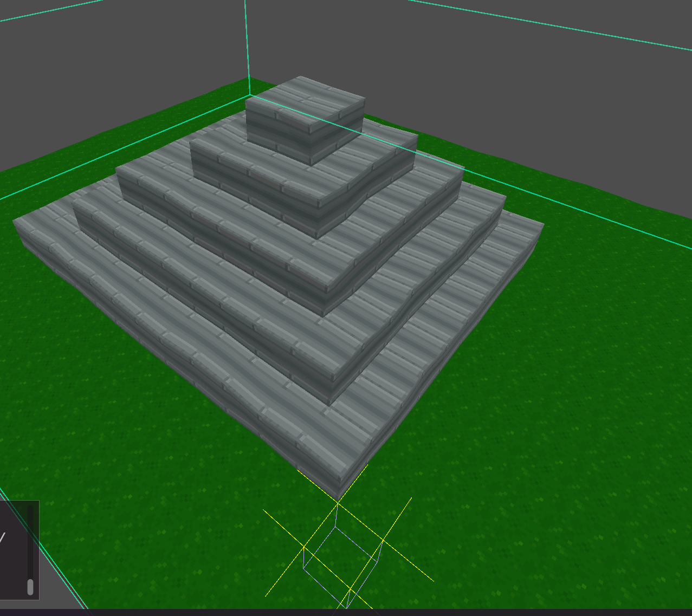
- **Shift+Click** : Smooth terrain, but all blocks added use the currently selected texture.
- **Right-Click+Drag** (then **Click** to set the depth) : Remove non-cube blocks.
- **Alt while dragging** : Use the initial click point as the *centre* of the area rather than a corner.

---

### 4.6  Hollow

- **Click+Drag** (then **Click** to set the depth) : Remove the enclosed cube blocks inside that box, keeping a shell one block thick around the outside of the cavity.
- **Alt while dragging** : Use the initial click point as the *centre* of the area rather than a corner.
 
---

### 4.7  Hill

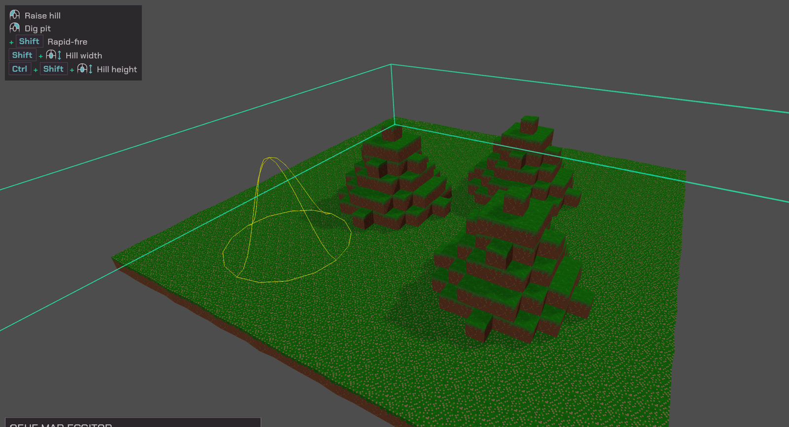

- **Click** : Drop blocks from above to form organic hills.
- **Right-Click** : Subtract hill-shape from terrain (will not make a hole in the terrain).
- **Shift (hold)** : Keep adding (or subtracting) hills as you move the cursor.
- **Shift+Wheel** : Adjust hill width.
- **Ctrl+Shift+Wheel** : Adjust hill height.

> [!NOTE]
> Useful for mountains and natural terrain; can be used to create 'geological'-looking layers.

---

### 4.8  Sculpt

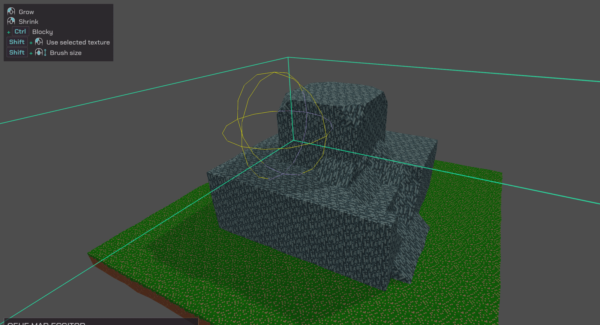

Sculpt and form terrain by dragging it about.

- **Click** (and drag) : Grow existing terrain inside the sphere, and tug it along with your cursor.
- **Right-Click** (and drag) : Shrink or erase terrain inside the sphere.
- **Ctrl** : Keep it blocky (tends to square-off terrain).
- **Shift+Click** : Grow terrain using the currently selected texture.
- **Shift+Wheel** : Adjust brush radius.

> [!NOTE]
> In mouse-view mode, you're dragging the terrain in the sphere around youre camera.  In free cursor mode, you're dragging it around the plane in front of your camera.

---

### 4.9  Sphere

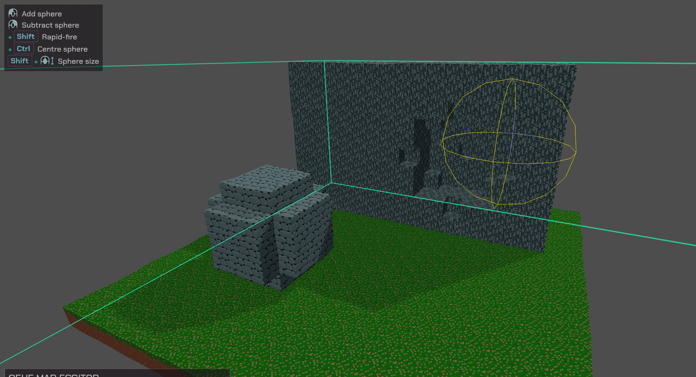

- **Click** : Add a sphere.
- **Right-Click** : Subtract a sphere (good for caves).
- **Shift (hold)** : Keep adding (or subtracting) spheres as you move the cursor.
- **Ctrl** : Centre sphere on the block you're highlighting.
- **Shift+Wheel** : Change sphere size.

---

### 4.10  2D Draw

- **Click+Drag** : Add a block where you're clicking.
- **Right-Click** : Remove blocks on the plane where you're clicking.
- **Ctrl (hold)** : Add/Remove blocks on the far side of the plane.
- **Shift+Wheel** : Move the plane further/closer to you.
- **Alt+Right-Click** : Align plane to highlighted face

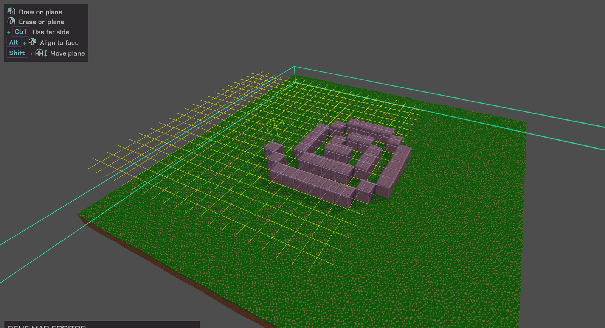

---

## 5. Entity Mode

Cycle to Entity Mode by pressing **Backtick** (**`**) until the Entity Mode UI appears (or by clicking the **Entities** button in the top-right corner).

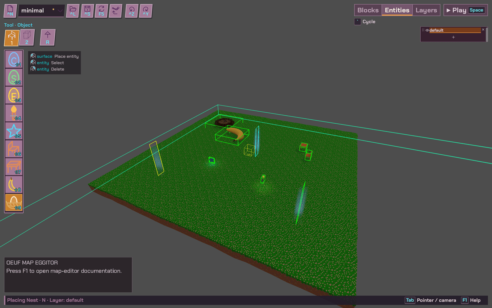

In Entity Mode there are two tools - the **Object Tool** and the **Trigger-Box Tool**.  Objects are things placed at a *single point* in the world that you can see, like checkpoints and torches.  Trigger boxes are larger invisible areas that trigger an effect when the player enters them, such as playing a music track or displaying a message.  

### 5.1 Controls

- **Click** : Place or select an entity.
- **Right-Click** : Delete an entity.
- **Wheel**, or **Shift+Number Key** : Choose which entity to place.

### 5.1  Object Tool

#### 5.1.1  Normal Checkpoint

- Totally normal checkpoint.
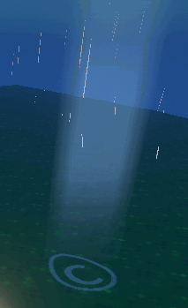
- The **Name** field says what text is shown when the player activates it.

> [!NOTE] 
> You will often want to put checkpoints inside music trigger-boxes so that if a player resumes a saved game, the correct music will play.

#### 5.1.2  Start-Checkpoint

- This is where the player spawns in custom maps; it looks just like a normal checkpoint.
- The **Name** field says what text is shown when the player starts a new game on this map.  The default value is `CUSTOM_LEVEL_LETS_GO`, a localisation tag that amounts to "Let's go!" in English and will be auto-translated into whatever language the player is playing in, but you can change it to whatever message you like.
- Every map *must* include a **Start-Checkpoint**.

#### 5.1.3  End-Checkpoint

- This behaves like a normal checkpoint (only the main game's Nest can trigger the start/end cutscenes), but has a bit more visual flourish when you hit it, and is what the game uses to tell whether or not you've finished the map.
- The default **Name** field value is `CUSTOM_LEVEL_YOU_MADE_IT`, which localises to "You made it!" in English and will be auto-translated into whatever language the player is playing in, but you can change it to whatever message you like.
- Every map *must* include a **End-Checkpoint**.

#### 5.1.4 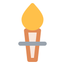 Torch

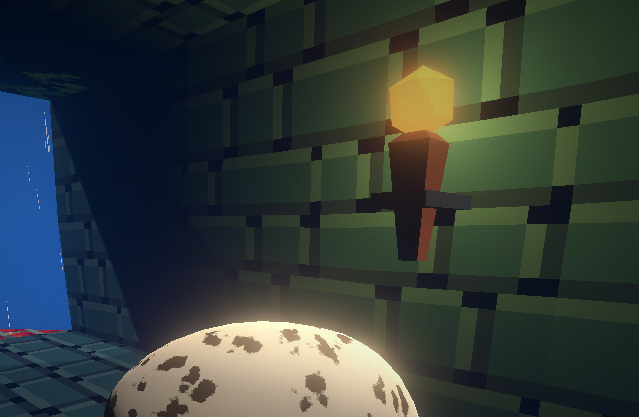

Provides a point of light.  Handy when things are getting a bit dark - but don't overdo it, as each torch adds a light source and the performance cost can add up.

#### 5.1.5  Star

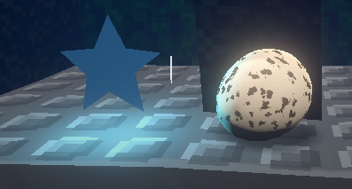

- Makes a nice sound when collected, and displays a running count of stars collected vs. the total number of stars on the map.

- The pause menu will have a stars submenu, showing a list of all the stars, along with hints for how to find them if you've specified them.

- Not used in the main game.

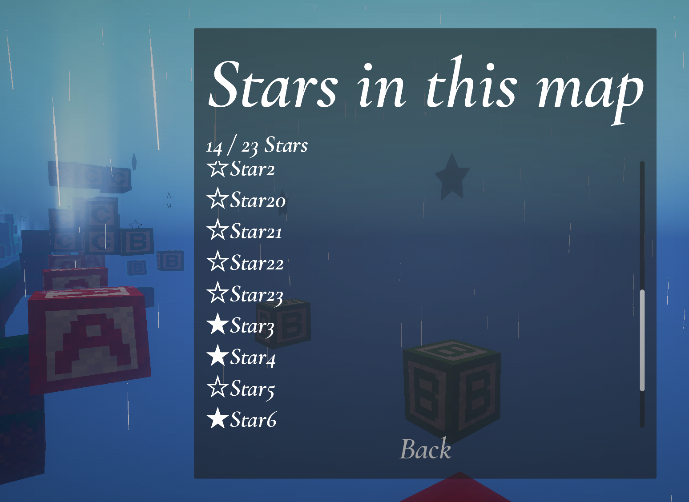

#### 5.1.6  Chair

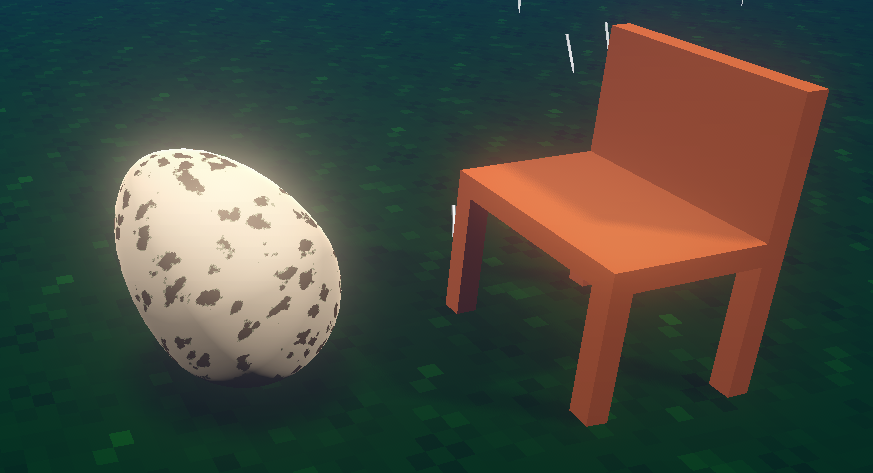

- Inert geometric object.  
- Not used in the main game.

#### 5.1.7  Table

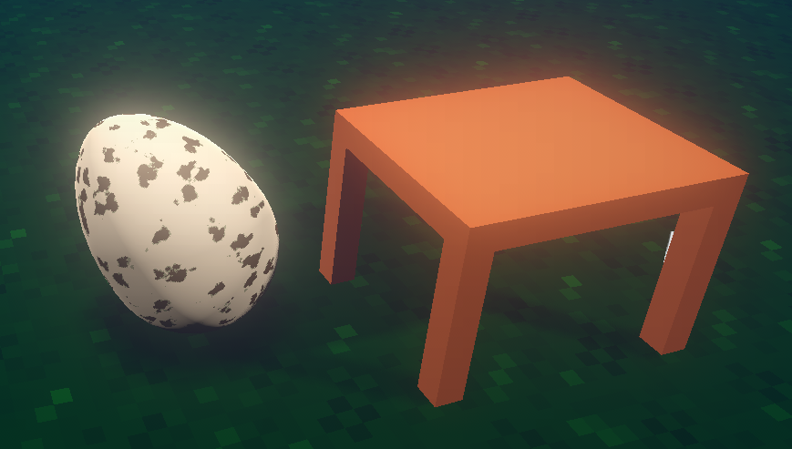

- Inert geometric object.  
- Not used in the main game.

#### 5.1.8  Banana

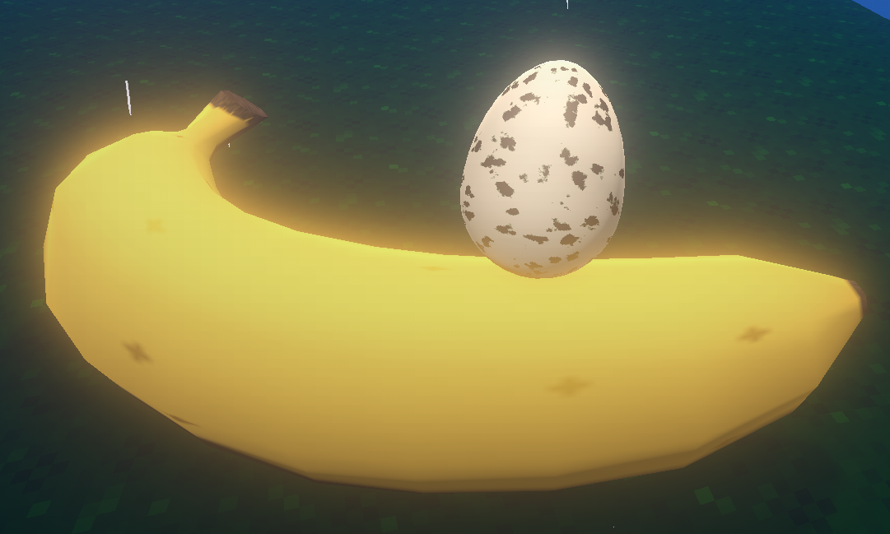

- Inert geometric object.  
- Not used in the main game.

#### 5.1.9  Nest

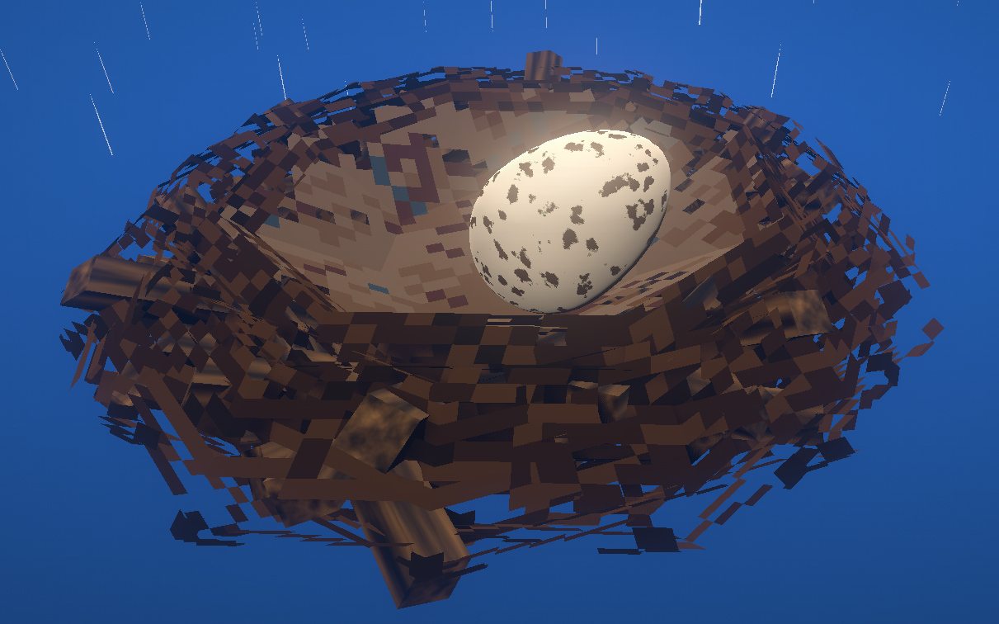

- In custom levels, this is an inert geometric object.  (in the base game level, it does lots of hard-coded stuff - if you're modding the base game you'll have to put in specific start/end-points).

#### 5.1.10 Other Objects

There are a few other objects in the main game map (such as the spawn-only checkpoint), but they have unusual or hard-coded behaviour tied to the main game, so they aren't in the palette. It's fine to leave them in place if you're modding the main game map, just be careful to not modify these objects or their surrounding geometry.

### 5.2 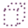 Trigger-Box Tool

- Trigger boxes are big invisible areas that do something (e.g. playing music or displaying a message) when the player enters them.
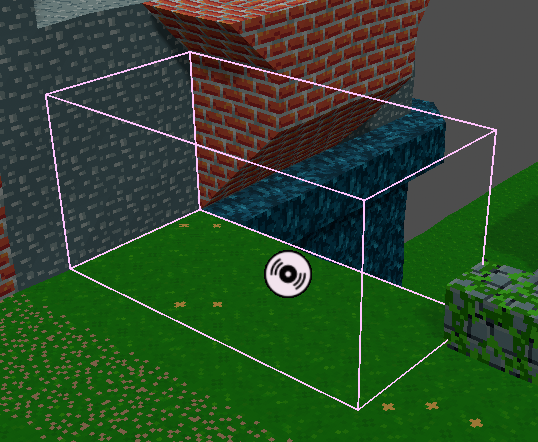

- In the properties panel you can edit various values, including position dimensions :
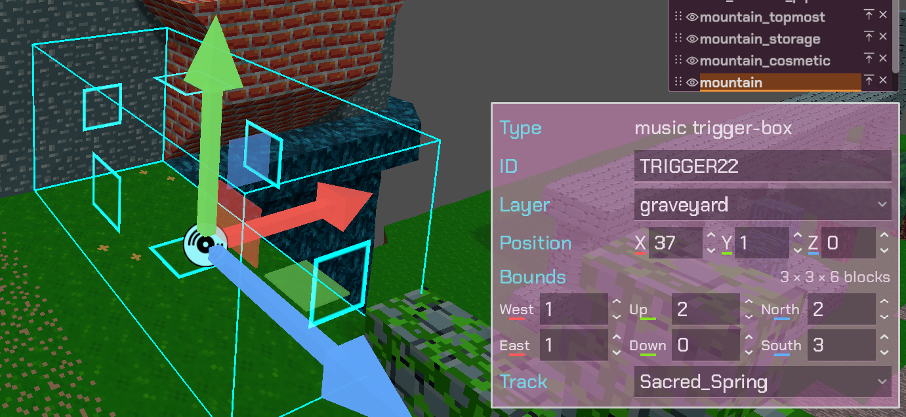

- You can also **move** and **resize** trigger boxes in the viewport using the **move gizmo** and **face resize handles** (drag the coloured squares in the centre of each face of the trigger-box).
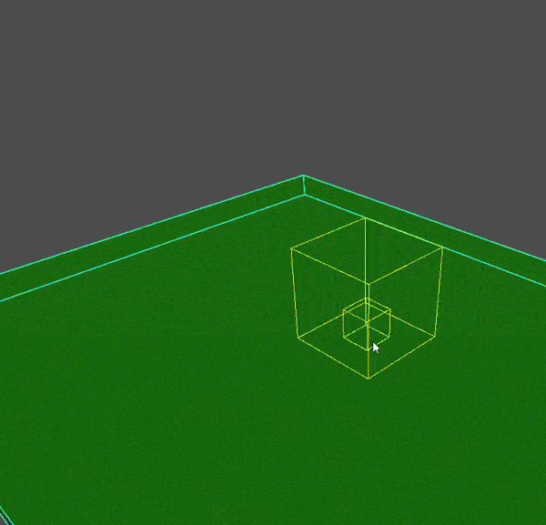
- Note that each trigger box has a 'core', the symbol that you click to select it. This occupies space in the the world - you can't have anything else at the same coordinate, though things can freely overlap the trigger area itself. (Technically the core doesn't need to be inside the trigger area, but...why would you do that?)

#### 5.2.1  music

- Starts playing a music track when the player enters.
- Usually you want to have a music trigger at each checkpoint so that the correct music plays when a player resumes a saved game.
- Choose the track from the dropdown in the properties panel.
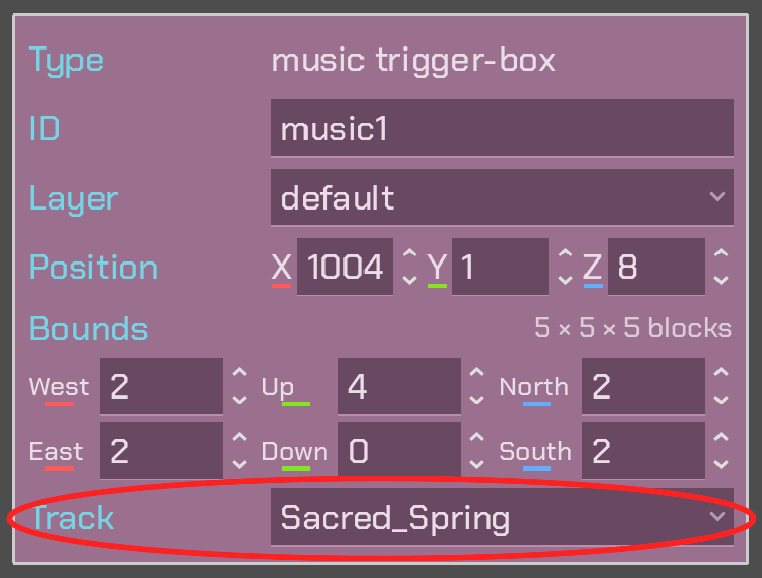
- Any time you select a music trigger-box, you'll hear a preview of its music.
- You can't add your own music files, but in addition to the main sountrack there are several hours of bonus tracks included for use in custom maps.
- The soundtrack is [here](https://store.steampowered.com/app/4217410/Oeuvre_Oeuf_Soundtrack/) if you want to listen to it outside the game.

#### 5.2.2  arealabel

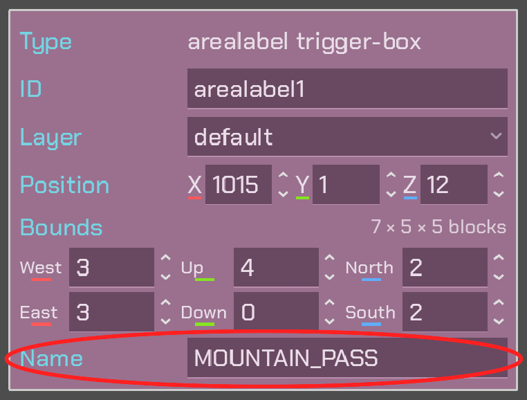

'arealabel' trigger boxes display a message on screen when the player enters, independently of checkpoints.  If its **Name** field matches a built-in location name (case-sensitive), the game localises it - e.g. entering `FOREST` displays "Forest of Branching Paths" in English.  Otherwise it just displays your text verbatim, so entering `Hello, world!` displays "Hello, world!".

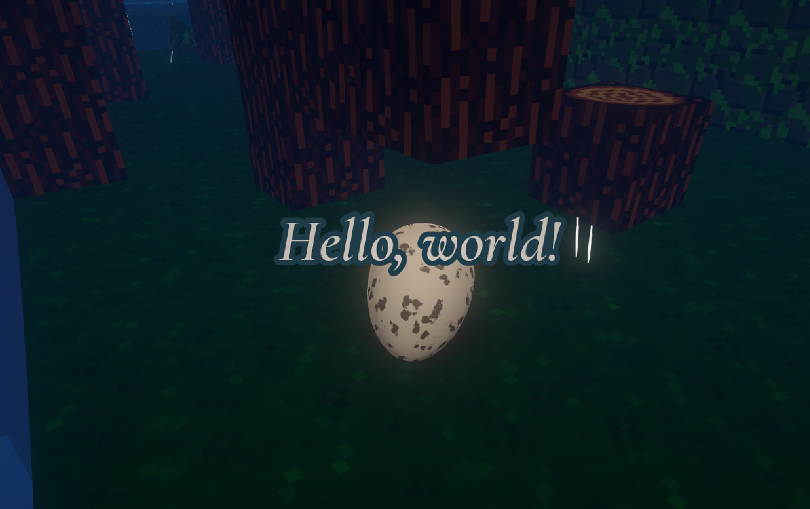

#### 5.2.3  KILLBOX

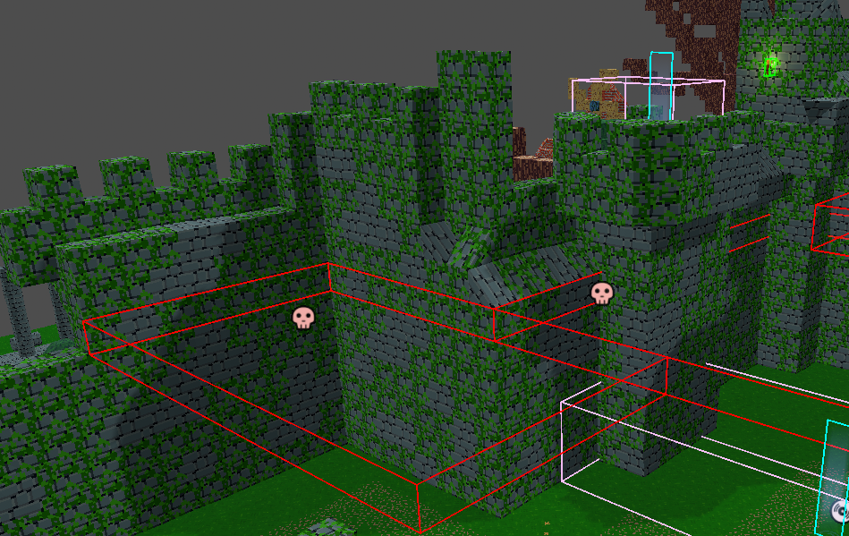

- If you enter a killbox, you are internally marked as *doomed*, and will oof the next time you touch horizontal-ish map geometry (ramps included).
- Drawn in red in the map view for easy identification.
- While *doomed*, you cannot trigger checkpoints until you restart *(but you can pick up stars!)*
- For want of a better place to put this information: there's a global killplane below y=-51.  Also, because the fog gets thicker when you go down, *nothing* below this plane will be visible.  There's no reason to have any geometry below y=-51.

#### 5.2.4  ILLUMINATION

While inside this trigger box, the player emits light.  Handy for subtly brightening dark areas without placing lots of torches around (which can be expensive to render and visually distracting).

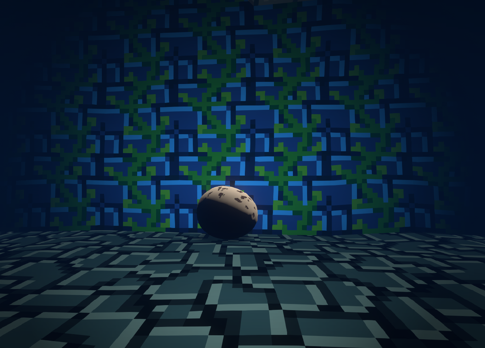

#### 5.2.5  Generic

There are a few other really finicky trigger-box types - what they do is specified by their **Command** field.  I don't think they're appropriate for general use, so I won't document them.  If you're modding the main game map it's fine to leave them in place - but pls don't use them in maps you're making from scratch, as they may behave unexpectedly.

---

## 6. Layer Mode

Cycle to Layer Mode with **Backtick** (**`**)  (or by clicking the Entities button in the top-right corner).  

It can be useful to divide large maps into layers - distinct blocks that can be manipulated independently of each other.

> [!NOTE]
> Only one block (or entity) can occupy a given position - neither blocks nor entities from different layers can overlap eacho ther, (regardless of layer visibiltiy).

### 6.1 Layer List

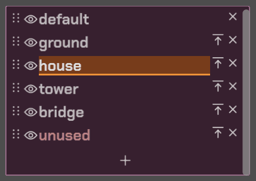

To the right-hand side of the screen you have the layer list.  

* You can double-click on a layer's name to edit it.
* Empty layers are shown with their names tinted red.

Here's an explanation of the avrious symbols:

#### 6.1.1  Drag Handle

* Drag a layer entry by its handle to rearrange layers.

#### 6.1.2  Visibility

- Toggles the visibility of the layer (visible : , hidden : ).

- **Shift+Click** a layer's visibility button to hide all other layers; **Shift+Click** again to restore them.
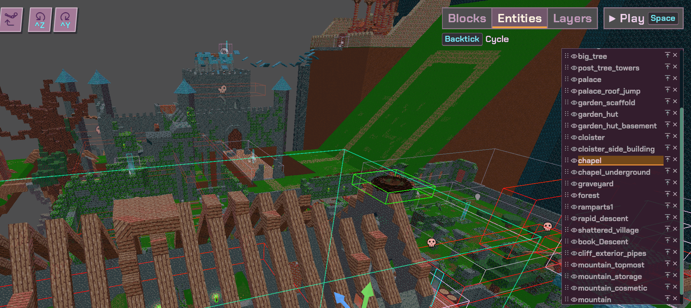

#### 6.1.3  Merge Up

Merges the layer into the layer above it.

#### 6.1.4  Delete

Deletes the layer.

#### 6.1.5  New Layer

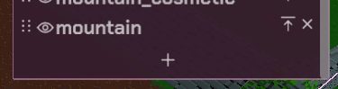
Creates a new empty layer.

---

### 6.2 Layer Tools

#### 6.2.1  Layer Transform

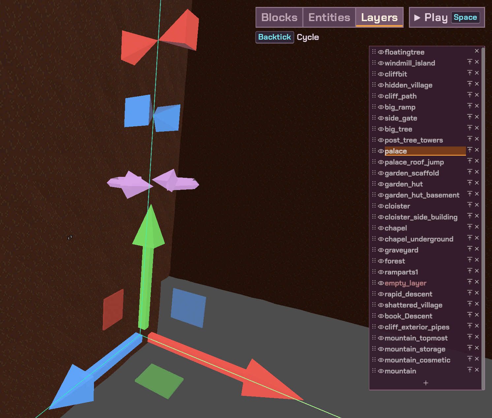

- **Click** : Select a layer.
- You can then **move**, **rotate**, or **mirror**/**flip** the entire layer using the gizmo.

> [!NOTE]
> Remember, two things cannot exist at the same coordinate, even if they are in different layers. If you move one layer to overlap another, things are going to get removed from the pressed-upon layer.

---

#### 6.2.2  Layer Assignment

- **Click+Drag** to define an area, then move your mouse and **Click** to set the depth : All visible blocks and entities inside get assigned to the currently selected layer.
- **Click** an entity : Assign it to the currently selected layer.
- **Alt while dragging** : Use the initial click point as the *centre* of the area rather than a corner.
- Useful for correcting blocks assigned to the wrong layer.

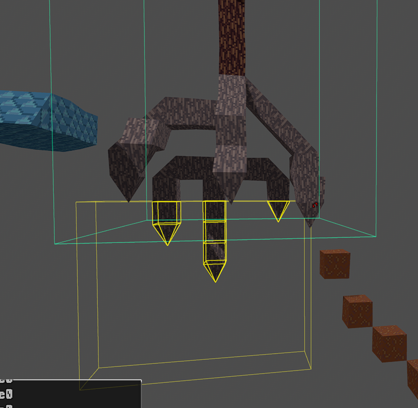

---

### 6.3  Clipboard

- **Click** on a layer to copy it to the clipboard.
- **Right-Click** : Paste the clipboard contents in the indicated position (shown as a purple box).
- You can copy and paste between different map files!

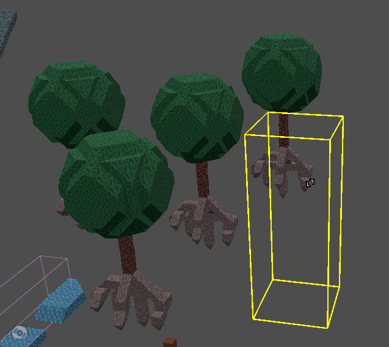

---

## 7.  Upload to Steam Workshop

When you're happy with your map and want to share it on the Steam Workshop, click the Steam button in the toolbar :

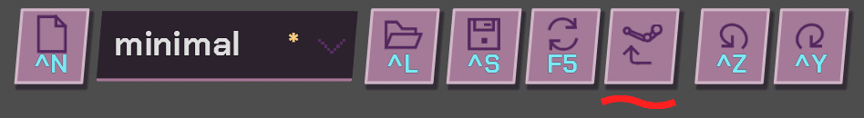

After a moment, you'll see a confirmation message and the Steam Workshop page for your map will open automatically.

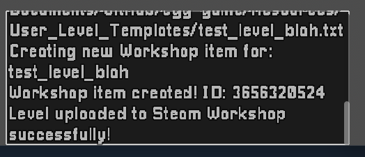

The thumbnail is generated from a screenshot of the current view when you save. 

> [!NOTE]
> If you hover over the 'submit to steam' icon you'll see an overlay showing the screenshot area (it will be cropped to be square). 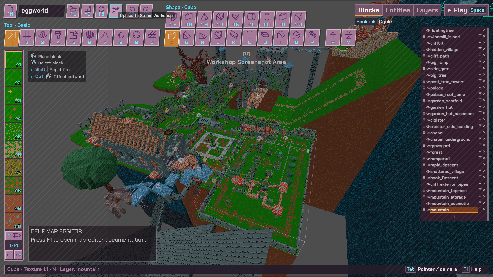

When it's finally uploaded, this page should open automatically in the steam overlay or your browser:

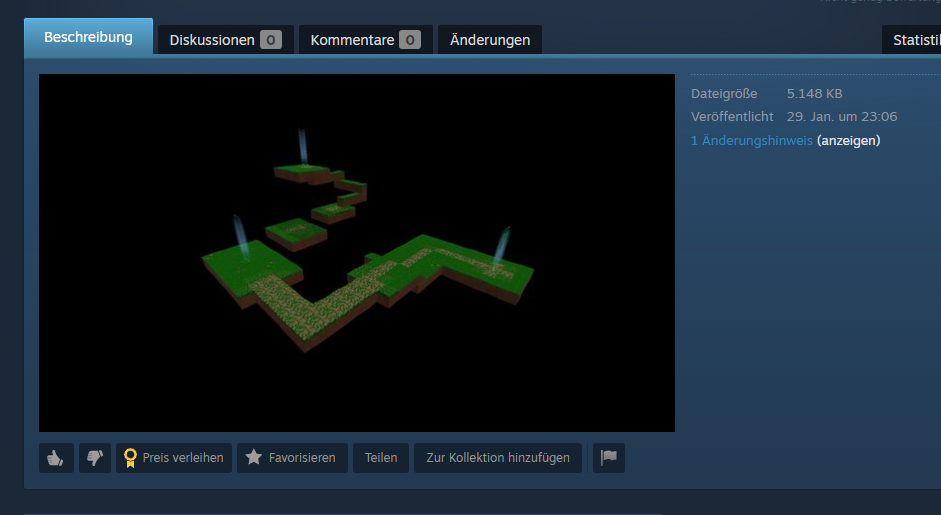

If you'd like to customise the listing further, you can do so from that page.  The mod is associated with the file name of the map - if you resubmit the same file, *or* the downloaded file from the workshop (resaved), it will update your map on the Steam Workshop.  Try to just use the OG filename though, it can be very confusing otherwise.

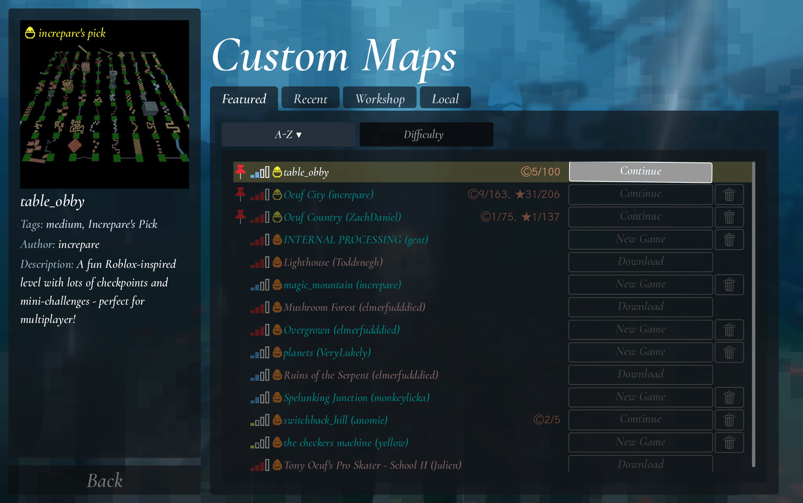

I have recently added a bunch of *tags* to Steam Workshop, which are displayed in the in-game browser.  They indicate difficulty, and also if I've given it my personal stamp of approval.  This is a bit dictatorial, but it's genuinely important to me that new players can have fun browsing the workshop and easily find things they might like.  They are set by me right now.  I try to play all games and rate them as easy/medium/hard if I can complete them.  If you think I've overlooked your game, drop me a line at [analytic@gmail.com](mailto:analytic@gmail.com) - I love playing Oeuf maps!

---

## 8.  Multiplayer Map Editor

### 8.1 Setting up a Co-op Editing Session

You can edit maps with your friends by turning on co-op editing when you are setting up to host a game.

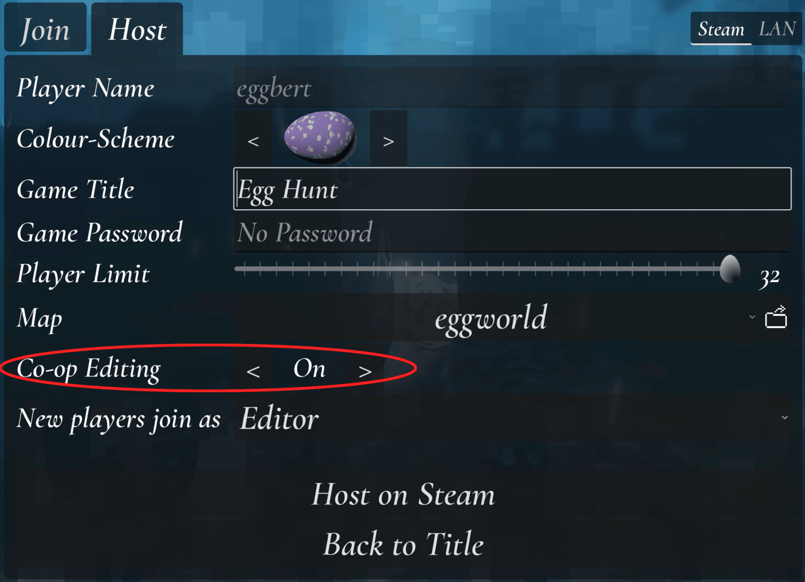

In the multiplayer lobby list, games that have co-op editing enabled have a  icon next to them:
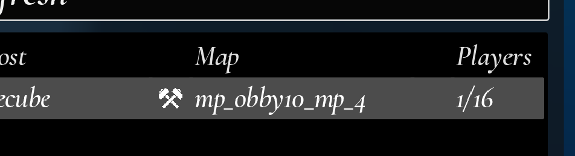

You can set whether new players have permission to edit the map by default on this menu, and you can change it from the pause menu in-game.  You can also toggle editing permission on and off for specific players there.
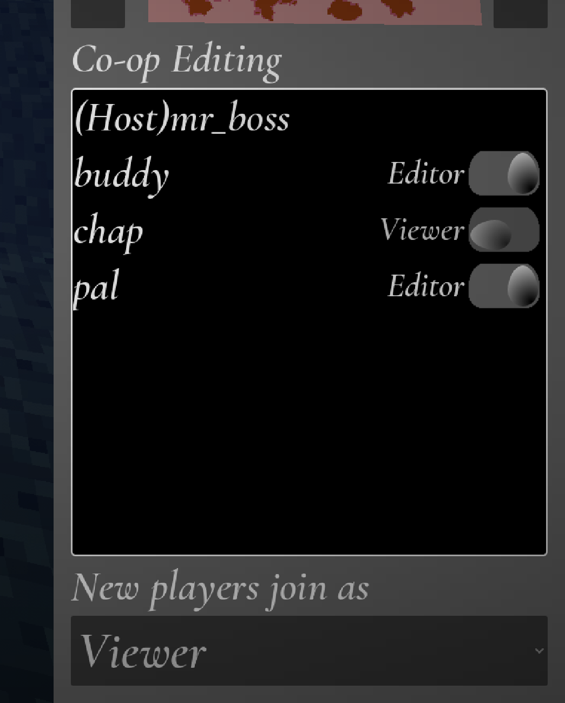

> [!NOTE]
> Certain operations are restricted in co-op editing mode.  These are operations that would potentially modify large chunks of the map.  So layer operations, flood-fill etc.  If you need to do these, ask the host to do them for you. 🙃

### 8.2 Banning Users from Editing

You can also block Steam users from editing the map based on their Steam IDs - this will not prevent them from *joining*/*playing* the map, but they won't be able to *edit* it.  To find a user's Steam ID, look at the log files  (open the maps folder, go up, then go into the logs folder).  You'll see some text like *"[Network] Player STEAM_ID has username USERNAME"*.  Then, in the directory above logs, there'll be a file called `banned_steam_users.txt` where you can add a line **STEAM_ID|REASON** - banned users will be told the reason if they try to edit a map.  You need to restart the game after this to reload the ban list.

---

## 9. Comparing different versions of a map

In the map editor, if you press **Ctrl+Shift+D**, a lovely little menu will pop up:

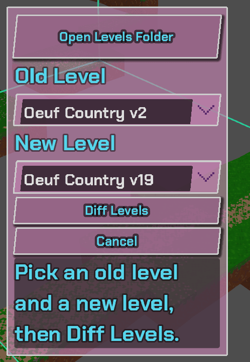

This looks at what things (blocks or entities) are different between the two maps, and separates them into layers so you can easily see what changed:

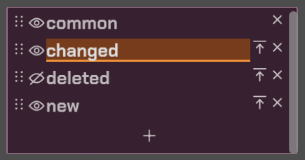

By hiding/showing layers you can get a pretty great overview of what the differences are.

This is a *very* useful tool when you've left a multiplayer editing server open overnight and want to know what happened while you were away.

---

## 10. Map file format specs

Oeuf stores its maps as plaintext, with space-separated values.  Each line starts with a token which indicates the type of data stored, and then information about it.  This is not a comprehensive spec, the idea is to give you enough to get started parsing/generating if you want to.  Happy to explain more if you want to know more.  Just drop me an email.

- **version** `VERSION_NUMBER`
    - `VERSION_NUMBER` : the version number of the map file format.
- **voxels** `VOXEL_COUNT` : how many voxels are in the map.
- **vx** `A` `B` `C` `D` `E` `F` `G` `H` `I`
    - `vx` : "this is a voxel"
    - `A` : 1 if what follows is an absolute coordinate, or 0 if given relative to the last-specified coordinate (saves file size a lot!)
    - `B` `C` `D` : (x,y,z) coordinates of voxel (either absolute or relative depending on above)
    - `E` : block shape index
    - `F` `G` : tilemap coordinates
    - `H` : rotation encoded as (rot + vflip * 4) (vflip = if vertically flipped)
    - `I` : layer index
- **layers** `LAYER_COUNT` : how many layers are in the map.
- **l** `LAYER_NAME` `VISIBILITY`
- **selected** `SELECTED_LAYER_INDEX`
- **cp** `X` `Y` `Z` : editor camera position
- **cbr** `X` `Y` `Z` : editor camera base rotation
- **crr** `X` `Y` `Z` : editor camera rot rotation (cbr and crr just encode rotations of the camera and its parents, can't be bothered to check what exactly they are)
- **entities_version** `ENTITY_VERSION_NUMBER` : version number of the entity section.
- **entities** `ENTITY_COUNT` : number of entities
- **e** `ENTITY_NAME` `ENTITY_TYPE` `X` `Y` `Z` `LAYER` `FLAGS` [...FLAG-DEPENDENT FIELDS]
    - `e` : "this is an entity"
    - `ENTITY_NAME` : entity name, surrounded by double-quotes
    - `ENTITY_TYPE` : entity type (integer).  `3` means a trigger-box (see below)
    - `X` `Y` `Z` : entity position (x y z)
    - `LAYER` : entity layer (present in `ENTITY_VERSION_NUMBER >= 3`)
    - `FLAGS` : bitfield controlling which optional fields follow (immediately after `FLAGS`)
        - If `bit0` (value `1`) is set : include `DIR_PLUS_ONE` (stores `dir+1`)
        - If `bit1` (value `2`) is set : include `"META"`
        - If `bit2` (value `4`) is set : include `"ASSET_NAME"` (e.g. `"Bonfire.tscn"`)
        - If `bit3` (value `8`) is set : include `COLOUR` (unsigned byte)
    - If `ENTITY_TYPE` is `3` (trigger-box), the line also includes two extra vectors at the end:
        - `size_EDS` : east/down/south extents (x y z)
        - `size_WUN` : west/up/north extents (x y z)

---

## 11. Feedback and Bug Reports

Does this make sense? I hope so! Feedback and bug reports are always welcome - e-mail me at [analytic@gmail.com](mailto:analytic@gmail.com).
